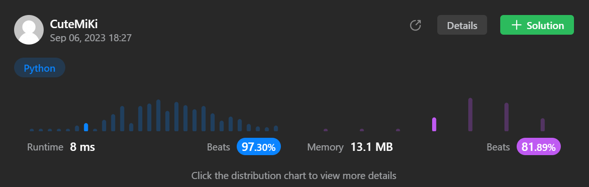

# 231. Power of Two
### Tag: [Easy](https://github.com/TheOnlyMiki/LeetCode-For-Fun/tree/main#easy-level), [Math](https://github.com/TheOnlyMiki/LeetCode-For-Fun/tree/main#math), [Bit Manipulation](https://github.com/TheOnlyMiki/LeetCode-For-Fun/tree/main#bit-manipulation)
---
<div class="px-5 pt-4"><div class="flex"></div><div class="xFUwe" data-track-load="description_content"><p>Given an integer <code>n</code>, return <em><code>true</code> if it is a power of two. Otherwise, return <code>false</code></em>.</p>

<p>An integer <code>n</code> is a power of two, if there exists an integer <code>x</code> such that <code>n == 2<sup>x</sup></code>.</p>

<p>&nbsp;</p>
<p><strong class="example">Example 1:</strong></p>

<pre><strong>Input:</strong> n = 1
<strong>Output:</strong> true
<strong>Explanation: </strong>2<sup>0</sup> = 1
</pre>

<p><strong class="example">Example 2:</strong></p>

<pre><strong>Input:</strong> n = 16
<strong>Output:</strong> true
<strong>Explanation: </strong>2<sup>4</sup> = 16
</pre>

<p><strong class="example">Example 3:</strong></p>

<pre><strong>Input:</strong> n = 3
<strong>Output:</strong> false
</pre>

<p>&nbsp;</p>
<p><strong>Constraints:</strong></p>

<ul>
	<li><code>-2<sup>31</sup> &lt;= n &lt;= 2<sup>31</sup> - 1</code></li>
</ul>

<p>&nbsp;</p>
<strong>Follow up:</strong> Could you solve it without loops/recursion?</div></div>

---


### Solution

```python
class Solution(object):
    def isPowerOfTwo(self, n):
        """
        :type n: int
        :rtype: bool
        """
        # Option 2
        return n > 0 and not (n & n - 1)

        # Option 1
        if n < 0:
            return False

        count = 0
        for i in range(32):
            if n & 1 == 1:
                count += 1

            n >>= 1

        return count == 1
```
