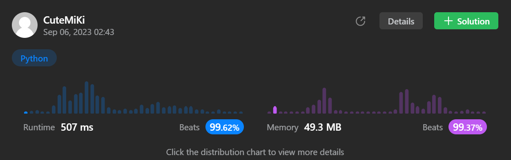

# 234. Palindrome Linked List
### Tag: [Easy](https://github.com/TheOnlyMiki/LeetCode-For-Fun/tree/main#easy-level), [Linked List](https://github.com/TheOnlyMiki/LeetCode-For-Fun/tree/main#linked-list), [Two Pointers](https://github.com/TheOnlyMiki/LeetCode-For-Fun/tree/main#two-pointers)
---
<div class="px-5 pt-4"><div class="flex"></div><div class="xFUwe" data-track-load="description_content"><p>Given the <code>head</code> of a singly linked list, return <code>true</code><em> if it is a </em><span data-keyword="palindrome-sequence" class=" cursor-pointer relative text-dark-blue-s text-sm"><div class="popover-wrapper inline-block" data-headlessui-state=""><div><div aria-expanded="false" data-headlessui-state="" id="headlessui-popover-button-:rv:"><div><em>palindrome</em></div></div><div style="position: fixed; z-index: 40; inset: 0px auto auto 0px; transform: translate(74px, 242px);"></div></div></div></span><em> or </em><code>false</code><em> otherwise</em>.</p>

<p>&nbsp;</p>
<p><strong class="example">Example 1:</strong></p>

<pre><strong>Input:</strong> head = [1,2,2,1]
<strong>Output:</strong> true
</pre>

<p><strong class="example">Example 2:</strong></p>

<pre><strong>Input:</strong> head = [1,2]
<strong>Output:</strong> false
</pre>

<p>&nbsp;</p>
<p><strong>Constraints:</strong></p>

<ul>
	<li>The number of nodes in the list is in the range <code>[1, 10<sup>5</sup>]</code>.</li>
	<li><code>0 &lt;= Node.val &lt;= 9</code></li>
</ul>

<p>&nbsp;</p>
<strong>Follow up:</strong> Could you do it in <code>O(n)</code> time and <code>O(1)</code> space?</div></div>

---


### Solution

```python
# Definition for singly-linked list.
# class ListNode(object):
#     def __init__(self, val=0, next=None):
#         self.val = val
#         self.next = next
class Solution(object):
    def isPalindrome(self, head):
        """
        :type head: ListNode
        :rtype: bool
        """
        # Option 2 - Space O(1)
        slow = fast = head
        previou = None
        while fast and fast.next:
            fast, slow.next, previou, slow = fast.next.next, previou, slow, slow.next

        if fast:
            slow = slow.next

        while previou and slow:
            if previou.val != slow.val:
                return False
            previou, slow = previou.next, slow.next

        return True

        # Option 1 - Space O(n)
        """
        record = []
        while head:
            record.append(head.val)
            head = head.next

        left, right = 0, len(record)-1
        while left < right:
            if record[left] != record[right]:
                return False
            left += 1
            right -= 1

        return True
        """
```
