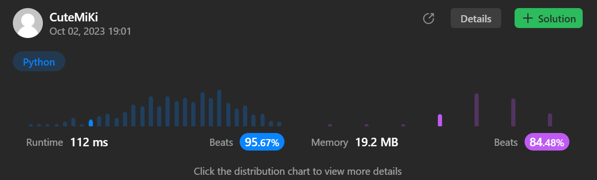

# 240. Search a 2D Matrix II
### Tag: [Medium](https://github.com/TheOnlyMiki/LeetCode-For-Fun/tree/main#medium-level), [Array](https://github.com/TheOnlyMiki/LeetCode-For-Fun/tree/main#array), [Binary Search](https://github.com/TheOnlyMiki/LeetCode-For-Fun/tree/main#binary-search), [Divide and Conquer](https://github.com/TheOnlyMiki/LeetCode-For-Fun/tree/main#divide-and-conquer), [Matrix](https://github.com/TheOnlyMiki/LeetCode-For-Fun/tree/main#matrix)
---
<div class="px-5 pt-4"><div class="flex"></div><div class="xFUwe" data-track-load="description_content"><p>Write an efficient algorithm that searches for a value <code>target</code> in an <code>m x n</code> integer matrix <code>matrix</code>. This matrix has the following properties:</p>

<ul>
	<li>Integers in each row are sorted in ascending from left to right.</li>
	<li>Integers in each column are sorted in ascending from top to bottom.</li>
</ul>

<p>&nbsp;</p>
<p><strong class="example">Example 1:</strong></p>

<pre><strong>Input:</strong> matrix = [[1,4,7,11,15],[2,5,8,12,19],[3,6,9,16,22],[10,13,14,17,24],[18,21,23,26,30]], target = 5
<strong>Output:</strong> true
</pre>

<p><strong class="example">Example 2:</strong></p>

<pre><strong>Input:</strong> matrix = [[1,4,7,11,15],[2,5,8,12,19],[3,6,9,16,22],[10,13,14,17,24],[18,21,23,26,30]], target = 20
<strong>Output:</strong> false
</pre>

<p>&nbsp;</p>
<p><strong>Constraints:</strong></p>

<ul>
	<li><code>m == matrix.length</code></li>
	<li><code>n == matrix[i].length</code></li>
	<li><code>1 &lt;= n, m &lt;= 300</code></li>
	<li><code>-10<sup>9</sup> &lt;= matrix[i][j] &lt;= 10<sup>9</sup></code></li>
	<li>All the integers in each row are <strong>sorted</strong> in ascending order.</li>
	<li>All the integers in each column are <strong>sorted</strong> in ascending order.</li>
	<li><code>-10<sup>9</sup> &lt;= target &lt;= 10<sup>9</sup></code></li>
</ul>
</div></div>

---


### Solution

```python
class Solution(object):
    def searchMatrix(self, matrix, target):
        """
        :type matrix: List[List[int]]
        :type target: int
        :rtype: bool
        """
        rows = len(matrix)
        left, right = 0, len(matrix[0])-1
        while left != rows and right != -1:
            if target > matrix[left][right]:
                left += 1
            elif target < matrix[left][right]:
                right -= 1
            else:
                return True

        return False
```
