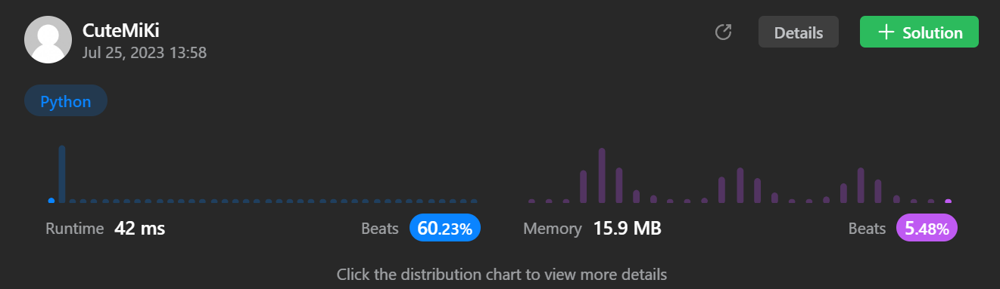

# 242. Valid Anagram
### Tag: [Easy](https://github.com/TheOnlyMiki/LeetCode-For-Fun/tree/main#easy-level), [Hash Table](https://github.com/TheOnlyMiki/LeetCode-For-Fun/tree/main#hash-table), [String](https://github.com/TheOnlyMiki/LeetCode-For-Fun/tree/main#string), [Sorting](https://github.com/TheOnlyMiki/LeetCode-For-Fun/tree/main#sorting)
---
<div class="px-5 pt-4"><div class="flex"></div><div class="_1l1MA" data-track-load="description_content"><p>Given two strings <code>s</code> and <code>t</code>, return <code>true</code> <em>if</em> <code>t</code> <em>is an anagram of</em> <code>s</code><em>, and</em> <code>false</code> <em>otherwise</em>.</p>

<p>An <strong>Anagram</strong> is a word or phrase formed by rearranging the letters of a different word or phrase, typically using all the original letters exactly once.</p>

<p>&nbsp;</p>
<p><strong class="example">Example 1:</strong></p>
<pre><strong>Input:</strong> s = "anagram", t = "nagaram"
<strong>Output:</strong> true
</pre><p><strong class="example">Example 2:</strong></p>
<pre><strong>Input:</strong> s = "rat", t = "car"
<strong>Output:</strong> false
</pre>
<p>&nbsp;</p>
<p><strong>Constraints:</strong></p>

<ul>
	<li><code>1 &lt;= s.length, t.length &lt;= 5 * 10<sup>4</sup></code></li>
	<li><code>s</code> and <code>t</code> consist of lowercase English letters.</li>
</ul>

<p>&nbsp;</p>
<p><strong>Follow up:</strong> What if the inputs contain Unicode characters? How would you adapt your solution to such a case?</p>
</div></div>

---


### Solution

```python
class Solution(object):
    def isAnagram(self, s, t):
        """
        :type s: str
        :type t: str
        :rtype: bool
        """

        s = s.decode()
        t = t.decode()

        count_s = {}
        count_t = {}

        try:
            for i in range(max(len(s), len(t))):
                if s[i] in count_s:
                    count_s[s[i]] += 1
                else:
                    count_s[s[i]] = 1

                if t[i] in count_t:
                    count_t[t[i]] += 1
                else:
                    count_t[t[i]] = 1
        except:
            return False

        return count_s == count_t
```
