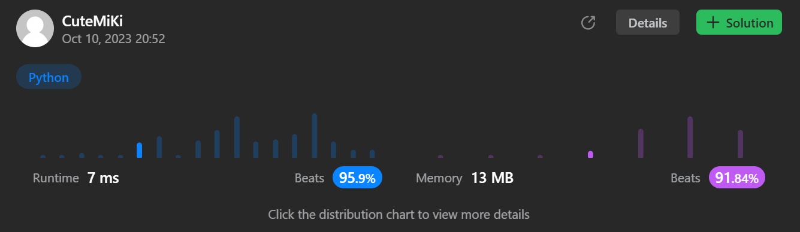

# 278. First Bad Version
### Tag: [Easy](https://github.com/TheOnlyMiki/LeetCode-For-Fun/tree/main#easy-level), [Binary Search](https://github.com/TheOnlyMiki/LeetCode-For-Fun/tree/main#binary-search)
---
<div class="px-5 pt-4"><div class="flex"></div><div class="xFUwe" data-track-load="description_content"><p>You are a product manager and currently leading a team to develop a new product. Unfortunately, the latest version of your product fails the quality check. Since each version is developed based on the previous version, all the versions after a bad version are also bad.</p>

<p>Suppose you have <code>n</code> versions <code>[1, 2, ..., n]</code> and you want to find out the first bad one, which causes all the following ones to be bad.</p>

<p>You are given an API <code>bool isBadVersion(version)</code> which returns whether <code>version</code> is bad. Implement a function to find the first bad version. You should minimize the number of calls to the API.</p>

<p>&nbsp;</p>
<p><strong class="example">Example 1:</strong></p>

<pre><strong>Input:</strong> n = 5, bad = 4
<strong>Output:</strong> 4
<strong>Explanation:</strong>
call isBadVersion(3) -&gt; false
call isBadVersion(5)&nbsp;-&gt; true
call isBadVersion(4)&nbsp;-&gt; true
Then 4 is the first bad version.
</pre>

<p><strong class="example">Example 2:</strong></p>

<pre><strong>Input:</strong> n = 1, bad = 1
<strong>Output:</strong> 1
</pre>

<p>&nbsp;</p>
<p><strong>Constraints:</strong></p>

<ul>
	<li><code>1 &lt;= bad &lt;= n &lt;= 2<sup>31</sup> - 1</code></li>
</ul>
</div></div>

---


### Solution

```python
# The isBadVersion API is already defined for you.
# @param version, an integer
# @return a bool
# def isBadVersion(version):

class Solution(object):
    def firstBadVersion(self, n):
        """
        :type n: int
        :rtype: int
        """
        left, right = 1, n
        while left < right:
            mid = (left + right) // 2
            if isBadVersion(mid):
                right = mid
            else:
                left = mid+1
                
        return left
```
