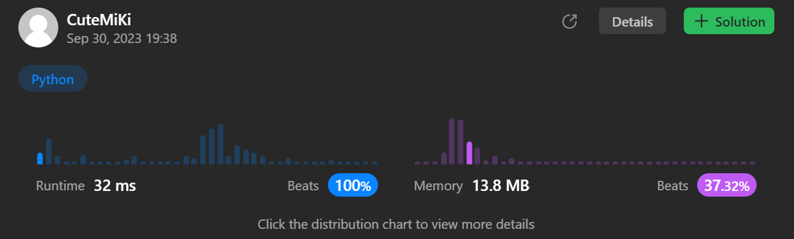

# 279. Perfect Squares
### Tag: [Medium](https://github.com/TheOnlyMiki/LeetCode-For-Fun/tree/main#medium-level), [Math](https://github.com/TheOnlyMiki/LeetCode-For-Fun/tree/main#math), [Dynamic Programming](https://github.com/TheOnlyMiki/LeetCode-For-Fun/tree/main#dynamic-programming), [Breadth-First Search](https://github.com/TheOnlyMiki/LeetCode-For-Fun/tree/main#breadth-first-search)
---
<div class="px-5 pt-4"><div class="flex"></div><div class="xFUwe" data-track-load="description_content"><p>Given an integer <code>n</code>, return <em>the least number of perfect square numbers that sum to</em> <code>n</code>.</p>

<p>A <strong>perfect square</strong> is an integer that is the square of an integer; in other words, it is the product of some integer with itself. For example, <code>1</code>, <code>4</code>, <code>9</code>, and <code>16</code> are perfect squares while <code>3</code> and <code>11</code> are not.</p>

<p>&nbsp;</p>
<p><strong class="example">Example 1:</strong></p>

<pre><strong>Input:</strong> n = 12
<strong>Output:</strong> 3
<strong>Explanation:</strong> 12 = 4 + 4 + 4.
</pre>

<p><strong class="example">Example 2:</strong></p>

<pre><strong>Input:</strong> n = 13
<strong>Output:</strong> 2
<strong>Explanation:</strong> 13 = 4 + 9.
</pre>

<p>&nbsp;</p>
<p><strong>Constraints:</strong></p>

<ul>
	<li><code>1 &lt;= n &lt;= 10<sup>4</sup></code></li>
</ul>
</div></div>

---


### Solution

```python
class Solution(object):
    def numSquares(self, n):
        """
        :type n: int
        :rtype: int
        """
        # Option 2 - DFS
        i, temp, length = 2, 4, n+1
        prefect = {1}
        while temp < length:
            prefect.add(temp)
            i, temp = i+1, (i+1)**2

        def dfs(num, count):
            if count == 1:
                return num in prefect

            for n in prefect:
                if dfs(num-n, count-1):
                    return True
                
            return False

        for i in range(1, length):
            if dfs(n, i):
                return i

        return -1

        # Option 1 - Dynamic Programming method
        """
        i, temp, length = 2, 4, n+1
        prefect = []
        while temp < length:
            prefect.append(temp)
            i, temp = i+1, (i+1)**2

        # 0 - 10
        record = [0,1,2,3,1,2,3,4,2,1,2]
        for num in range(11, length):
            minimum = num - record[num-1]
            for square in prefect:
                if minimum == 0 or square > num:
                    break
                if minimum > record[num - square]:
                    minimum = record[num - square]

            record.append(minimum+1)
        
        return record[n]
        """
```
