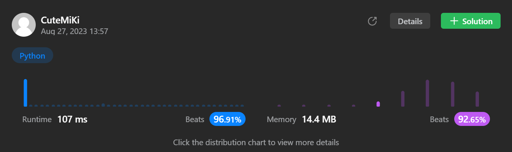

# 283. Move Zeroes
### Tag: [Easy](https://github.com/TheOnlyMiki/LeetCode-For-Fun/tree/main#easy-level), [Array](https://github.com/TheOnlyMiki/LeetCode-For-Fun/tree/main#array), [Two Pointers](https://github.com/TheOnlyMiki/LeetCode-For-Fun/tree/main#two-pointers)
---
<div class="px-5 pt-4"><div class="flex"></div><div class="xFUwe" data-track-load="description_content"><p>Given an integer array <code>nums</code>, move all <code>0</code>'s to the end of it while maintaining the relative order of the non-zero elements.</p>

<p><strong>Note</strong> that you must do this in-place without making a copy of the array.</p>

<p>&nbsp;</p>
<p><strong class="example">Example 1:</strong></p>
<pre><strong>Input:</strong> nums = [0,1,0,3,12]
<strong>Output:</strong> [1,3,12,0,0]
</pre><p><strong class="example">Example 2:</strong></p>
<pre><strong>Input:</strong> nums = [0]
<strong>Output:</strong> [0]
</pre>
<p>&nbsp;</p>
<p><strong>Constraints:</strong></p>

<ul>
	<li><code>1 &lt;= nums.length &lt;= 10<sup>4</sup></code></li>
	<li><code>-2<sup>31</sup> &lt;= nums[i] &lt;= 2<sup>31</sup> - 1</code></li>
</ul>

<p>&nbsp;</p>
<strong>Follow up:</strong> Could you minimize the total number of operations done?</div></div>

---


### Solution

```python
class Solution(object):
    def moveZeroes(self, nums):
        """
        :type nums: List[int]
        :rtype: None Do not return anything, modify nums in-place instead.
        """
        # Option 2 - Slow and fast pointers
        length = len(nums)
        left, right = 0, 1

        while right < length:
            while left < right and nums[left] != 0:
                left += 1

            while right < length and nums[right] == 0:
                right += 1

            if right == length:
                break

            nums[left], nums[right] = nums[right], nums[left]
            left += 1
            right += 1

        # Option 1 - Cannot pass, cause answer requires sorted?
        """
        left, right = 0, len(nums)-1

        while left < right:
            while left < right and nums[left] != 0:
                left += 1

            while left < right and nums[right] == 0:
                right -= 1

            nums[left], nums[right] = nums[right], nums[left]
            left += 1
            right -= 1
        """
```
