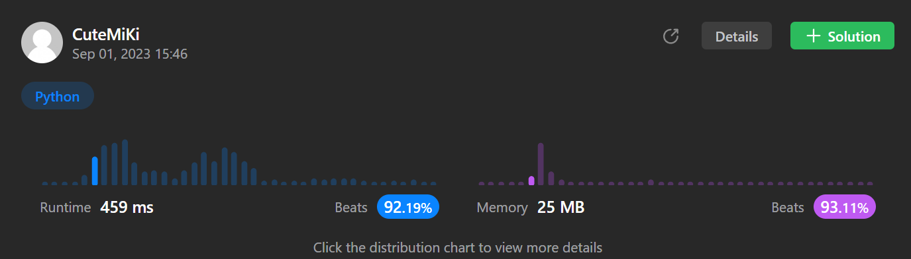

# 287. Find the Duplicate Number
### Tag: [Medium](https://github.com/TheOnlyMiki/LeetCode-For-Fun/tree/main#medium-level), [Array](https://github.com/TheOnlyMiki/LeetCode-For-Fun/tree/main#array), [Two Pointers](https://github.com/TheOnlyMiki/LeetCode-For-Fun/tree/main#two-pointers), [Binary Search](https://github.com/TheOnlyMiki/LeetCode-For-Fun/tree/main#binary-search), [Bit Manipulation](https://github.com/TheOnlyMiki/LeetCode-For-Fun/tree/main#bit-manipulation)
---
<div class="px-5 pt-4"><div class="flex"></div><div class="xFUwe" data-track-load="description_content"><p>Given an array of integers <code>nums</code> containing&nbsp;<code>n + 1</code> integers where each integer is in the range <code>[1, n]</code> inclusive.</p>

<p>There is only <strong>one repeated number</strong> in <code>nums</code>, return <em>this&nbsp;repeated&nbsp;number</em>.</p>

<p>You must solve the problem <strong>without</strong> modifying the array <code>nums</code>&nbsp;and uses only constant extra space.</p>

<p>&nbsp;</p>
<p><strong class="example">Example 1:</strong></p>

<pre><strong>Input:</strong> nums = [1,3,4,2,2]
<strong>Output:</strong> 2
</pre>

<p><strong class="example">Example 2:</strong></p>

<pre><strong>Input:</strong> nums = [3,1,3,4,2]
<strong>Output:</strong> 3
</pre>

<p>&nbsp;</p>
<p><strong>Constraints:</strong></p>

<ul>
	<li><code>1 &lt;= n &lt;= 10<sup>5</sup></code></li>
	<li><code>nums.length == n + 1</code></li>
	<li><code>1 &lt;= nums[i] &lt;= n</code></li>
	<li>All the integers in <code>nums</code> appear only <strong>once</strong> except for <strong>precisely one integer</strong> which appears <strong>two or more</strong> times.</li>
</ul>

<p>&nbsp;</p>
<p><b>Follow up:</b></p>

<ul>
	<li>How can we prove that at least one duplicate number must exist in <code>nums</code>?</li>
	<li>Can you solve the problem in linear runtime complexity?</li>
</ul>
</div></div>

---


### Solution

```python
class Solution(object):
    def findDuplicate(self, nums):
        """
        :type nums: List[int]
        :rtype: int
        """
        # Same as circle linked list question, Space O(1)
        slow, fast = nums[0], nums[nums[0]]
        while slow != fast:
            slow, fast = nums[slow], nums[nums[fast]]
        
        fast = 0
        while slow != fast:
            slow, fast = nums[slow], nums[fast]

        return slow
```
