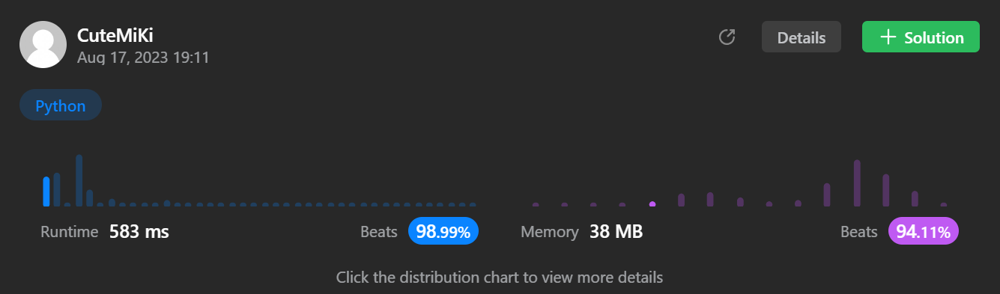

# 295. Find Median from Data Stream
### Tag: [Hard](https://github.com/TheOnlyMiki/LeetCode-For-Fun/tree/main#hard-level), [Two Pointers](https://github.com/TheOnlyMiki/LeetCode-For-Fun/tree/main#two-pointers), [Design](https://github.com/TheOnlyMiki/LeetCode-For-Fun/tree/main#design), [Sorting](https://github.com/TheOnlyMiki/LeetCode-For-Fun/tree/main#sorting), [Queue](https://github.com/TheOnlyMiki/LeetCode-For-Fun/tree/main#queue)
---
<div class="px-5 pt-4"><div class="flex"></div><div class="xFUwe" data-track-load="description_content"><p>The <strong>median</strong> is the middle value in an ordered integer list. If the size of the list is even, there is no middle value, and the median is the mean of the two middle values.</p>

<ul>
	<li>For example, for <code>arr = [2,3,4]</code>, the median is <code>3</code>.</li>
	<li>For example, for <code>arr = [2,3]</code>, the median is <code>(2 + 3) / 2 = 2.5</code>.</li>
</ul>

<p>Implement the MedianFinder class:</p>

<ul>
	<li><code>MedianFinder()</code> initializes the <code>MedianFinder</code> object.</li>
	<li><code>void addNum(int num)</code> adds the integer <code>num</code> from the data stream to the data structure.</li>
	<li><code>double findMedian()</code> returns the median of all elements so far. Answers within <code>10<sup>-5</sup></code> of the actual answer will be accepted.</li>
</ul>

<p>&nbsp;</p>
<p><strong class="example">Example 1:</strong></p>

<pre><strong>Input</strong>
["MedianFinder", "addNum", "addNum", "findMedian", "addNum", "findMedian"]
[[], [1], [2], [], [3], []]
<strong>Output</strong>
[null, null, null, 1.5, null, 2.0]

<strong>Explanation</strong>
MedianFinder medianFinder = new MedianFinder();
medianFinder.addNum(1);    // arr = [1]
medianFinder.addNum(2);    // arr = [1, 2]
medianFinder.findMedian(); // return 1.5 (i.e., (1 + 2) / 2)
medianFinder.addNum(3);    // arr[1, 2, 3]
medianFinder.findMedian(); // return 2.0
</pre>

<p>&nbsp;</p>
<p><strong>Constraints:</strong></p>

<ul>
	<li><code>-10<sup>5</sup> &lt;= num &lt;= 10<sup>5</sup></code></li>
	<li>There will be at least one element in the data structure before calling <code>findMedian</code>.</li>
	<li>At most <code>5 * 10<sup>4</sup></code> calls will be made to <code>addNum</code> and <code>findMedian</code>.</li>
</ul>

<p>&nbsp;</p>
<p><strong>Follow up:</strong></p>

<ul>
	<li>If all integer numbers from the stream are in the range <code>[0, 100]</code>, how would you optimize your solution?</li>
	<li>If <code>99%</code> of all integer numbers from the stream are in the range <code>[0, 100]</code>, how would you optimize your solution?</li>
</ul>
</div></div>

---


### Solution

```python
# Option 2 - Using two heap to store the smaller(max heap) and grather(min heap) numbers 
class MedianFinder(object):

    def __init__(self):
        """
        initialize your data structure here.
        """
        self.small, self.large = [], []

    def addNum(self, num):
        if self.large and num > self.large[0]:
            heapq.heappush(self.large, num)
        else:
            heapq.heappush(self.small,-num)

        if len(self.small) > len(self.large) + 1:
            heapq.heappush(self.large, -heapq.heappop(self.small))
        if len(self.large) > len(self.small) + 1:
            heapq.heappush(self.small, -heapq.heappop(self.large))

    def findMedian(self):
        if len(self.small) > len(self.large):
            return -self.small[0]
        elif len(self.large) > len(self.small):
            return self.large[0]
        return (-self.small[0] + self.large[0]) / 2.0

# Option 1 - binary search method for finding index
'''
class MedianFinder(object):

    def __init__(self):
        self.length = 0
        self.store = []
        self.target = None

    def findIndex(self, left, right):
        if self.store[right-1] <= self.target:
            return right

        mid = temp = None
        while left <= right:
            mid = (left + right) // 2
            temp = self.store[mid]
            if self.target < temp:
                right = mid-1
            elif self.target > temp:
                left = mid+1
            else:
                return mid

        return left

    def addNum(self, num):
        """
        :type num: int
        :rtype: None
        """
        if self.store:
            self.target = num
            i = self.findIndex(0, self.length)
            self.store.insert(i, num)
        else:
            self.store.append(num)
        self.length += 1

    def findMedian(self):
        """
        :rtype: float
        """
        left, right = self.length/2, (self.length-1)/2
        return (self.store[left] + self.store[right]) / 2.0
'''

# Your MedianFinder object will be instantiated and called as such:
# obj = MedianFinder()
# obj.addNum(num)
# param_2 = obj.findMedian()
```
