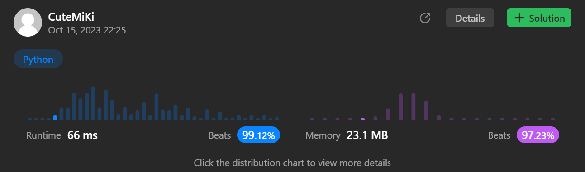

# 297. Serialize and Deserialize Binary Tree
### Tag: [Hard](https://github.com/TheOnlyMiki/LeetCode-For-Fun/tree/main#hard-level), [String](https://github.com/TheOnlyMiki/LeetCode-For-Fun/tree/main#string), [Depth-First Search](https://github.com/TheOnlyMiki/LeetCode-For-Fun/tree/main#depth-first-search), [Breadth-First Search](https://github.com/TheOnlyMiki/LeetCode-For-Fun/tree/main#breadth-first-search), [Design](https://github.com/TheOnlyMiki/LeetCode-For-Fun/tree/main#design), [Binary Tree](https://github.com/TheOnlyMiki/LeetCode-For-Fun/tree/main#binary-tree)
---
<div class="px-5 pt-4"><div class="flex"></div><div class="xFUwe" data-track-load="description_content"><p>Serialization is the process of converting a data structure or object into a sequence of bits so that it can be stored in a file or memory buffer, or transmitted across a network connection link to be reconstructed later in the same or another computer environment.</p>

<p>Design an algorithm to serialize and deserialize a binary tree. There is no restriction on how your serialization/deserialization algorithm should work. You just need to ensure that a binary tree can be serialized to a string and this string can be deserialized to the original tree structure.</p>

<p><strong>Clarification:</strong> The input/output format is the same as <a href="https://support.leetcode.com/hc/en-us/articles/360011883654-What-does-1-null-2-3-mean-in-binary-tree-representation-" target="_blank">how LeetCode serializes a binary tree</a>. You do not necessarily need to follow this format, so please be creative and come up with different approaches yourself.</p>

<p>&nbsp;</p>
<p><strong class="example">Example 1:</strong></p>

<pre><strong>Input:</strong> root = [1,2,3,null,null,4,5]
<strong>Output:</strong> [1,2,3,null,null,4,5]
</pre>

<p><strong class="example">Example 2:</strong></p>

<pre><strong>Input:</strong> root = []
<strong>Output:</strong> []
</pre>

<p>&nbsp;</p>
<p><strong>Constraints:</strong></p>

<ul>
	<li>The number of nodes in the tree is in the range <code>[0, 10<sup>4</sup>]</code>.</li>
	<li><code>-1000 &lt;= Node.val &lt;= 1000</code></li>
</ul>
</div></div>

---


### Solution

```python
# Definition for a binary tree node.
# class TreeNode(object):
#     def __init__(self, x):
#         self.val = x
#         self.left = None
#         self.right = None

class Codec:

    # Option 2 - DFS method
    """
    def serialize(self, root):
        if not root:
            return ""

        def readTree(nodes, node):
            if node:
                nodes.append(str(node.val))
                readTree(nodes, node.left)
                readTree(nodes, node.right)
            else:
                nodes.append('.')

        store = []
        readTree(store, root)
        return ' '.join(reversed(store))

    def deserialize(self, data):
        def buildTree(nodes):
            if nodes:
                num = nodes.pop()
                if num == '.':
                    return None

                node = TreeNode(int(num))
                node.left = buildTree(nodes)
                node.right = buildTree(nodes)
                return node

            return None
        
        return buildTree(data.split())
        """

    # Option 1 - BFS method
    def serialize(self, root):
        if not root:
            return ""

        nodes = [root]
        output = []
        while nodes:
            next_level = []

            for node in nodes:
                if node:
                    next_level += [node.left, node.right]
                    output.append(str(node.val))
                else:
                    output.append('.')

            nodes = next_level
        
        return ' '.join(reversed(output))

    def deserialize(self, data):
        if not data:
            return None

        data = data.split()
        head = TreeNode(int(data.pop()))
        nodes = [head]

        while nodes:
            next_level = []

            for node in nodes:
                left = data.pop()
                if left != '.':
                    node.left = TreeNode(int(left))
                    next_level.append(node.left)

                right = data.pop()
                if right != '.':
                    node.right = TreeNode(int(right))
                    next_level.append(node.right)
                
            nodes = next_level
        
        return head
        

# Your Codec object will be instantiated and called as such:
# ser = Codec()
# deser = Codec()
# ans = deser.deserialize(ser.serialize(root))
```
