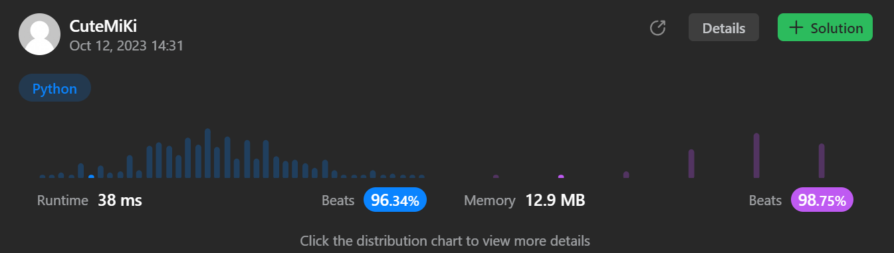

# 326. Power of Three
### Tag: [Easy](https://github.com/TheOnlyMiki/LeetCode-For-Fun/tree/main#easy-level), [Math](https://github.com/TheOnlyMiki/LeetCode-For-Fun/tree/main#math)
---
<div class="px-5 pt-4"><div class="flex"></div><div class="xFUwe" data-track-load="description_content"><p>Given an integer <code>n</code>, return <em><code>true</code> if it is a power of three. Otherwise, return <code>false</code></em>.</p>

<p>An integer <code>n</code> is a power of three, if there exists an integer <code>x</code> such that <code>n == 3<sup>x</sup></code>.</p>

<p>&nbsp;</p>
<p><strong class="example">Example 1:</strong></p>

<pre><strong>Input:</strong> n = 27
<strong>Output:</strong> true
<strong>Explanation:</strong> 27 = 3<sup>3</sup>
</pre>

<p><strong class="example">Example 2:</strong></p>

<pre><strong>Input:</strong> n = 0
<strong>Output:</strong> false
<strong>Explanation:</strong> There is no x where 3<sup>x</sup> = 0.
</pre>

<p><strong class="example">Example 3:</strong></p>

<pre><strong>Input:</strong> n = -1
<strong>Output:</strong> false
<strong>Explanation:</strong> There is no x where 3<sup>x</sup> = (-1).
</pre>

<p>&nbsp;</p>
<p><strong>Constraints:</strong></p>

<ul>
	<li><code>-2<sup>31</sup> &lt;= n &lt;= 2<sup>31</sup> - 1</code></li>
</ul>

<p>&nbsp;</p>
<strong>Follow up:</strong> Could you solve it without loops/recursion?</div></div>

---


### Solution

```python
class Solution(object):
    def isPowerOfThree(self, n):
        """
        :type n: int
        :rtype: bool
        """
        # Option 4 - If we know the maximum for power of 3
        #return n > 0 and 3**19 % n == 0
        return n > 0 and 1162261467 % n == 0

        # Option 3 - BF, Devide by 3
        """
        if n < 1:
            return False

        while n != 1:
            n, temp = divmod(n, 3)
            if temp != 0:
                return False

        return True
        """

        # Option 2 - BF, Times 3 with global variable
        """
        global record
        try:
            return n in record
        except:
            record = {1}
            num = 1
            for _ in range(19):
                num *= 3
                record.add(num)

        return n in record
        """

        # Option 1 - BF, Times 3
        """
        num = 1
        while num < n:
            num *= 3

        return n == num
        """
```
