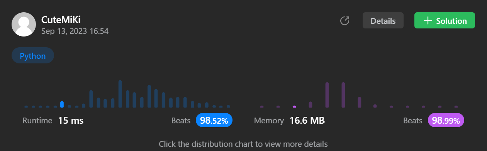

# 328. Odd Even Linked List
### Tag: [Medium](https://github.com/TheOnlyMiki/LeetCode-For-Fun/tree/main#medium-level), [Linked List](https://github.com/TheOnlyMiki/LeetCode-For-Fun/tree/main#linked-list)
---
<div class="px-5 pt-4"><div class="flex"></div><div class="xFUwe" data-track-load="description_content"><p>Given the <code>head</code> of a singly linked list, group all the nodes with odd indices together followed by the nodes with even indices, and return <em>the reordered list</em>.</p>

<p>The <strong>first</strong> node is considered <strong>odd</strong>, and the <strong>second</strong> node is <strong>even</strong>, and so on.</p>

<p>Note that the relative order inside both the even and odd groups should remain as it was in the input.</p>

<p>You must solve the problem&nbsp;in <code>O(1)</code>&nbsp;extra space complexity and <code>O(n)</code> time complexity.</p>

<p>&nbsp;</p>
<p><strong class="example">Example 1:</strong></p>

<pre><strong>Input:</strong> head = [1,2,3,4,5]
<strong>Output:</strong> [1,3,5,2,4]
</pre>

<p><strong class="example">Example 2:</strong></p>

<pre><strong>Input:</strong> head = [2,1,3,5,6,4,7]
<strong>Output:</strong> [2,3,6,7,1,5,4]
</pre>

<p>&nbsp;</p>
<p><strong>Constraints:</strong></p>

<ul>
	<li>The number of nodes in the linked list is in the range <code>[0, 10<sup>4</sup>]</code>.</li>
	<li><code>-10<sup>6</sup> &lt;= Node.val &lt;= 10<sup>6</sup></code></li>
</ul>
</div></div>
---


### Solution

```python
# Definition for singly-linked list.
# class ListNode(object):
#     def __init__(self, val=0, next=None):
#         self.val = val
#         self.next = next
class Solution(object):
    def oddEvenList(self, head):
        """
        :type head: ListNode
        :rtype: ListNode
        """
        even = head
        odd = odd_head = head.next if even else None
        current = head.next.next if odd else None
        i = True

        while current:
            if i:
                even.next = current
                even = current
                i = False
            else:
                odd.next = current
                odd = current
                i = True

            current = current.next

        if even and odd_head:
            even.next = odd_head
            odd.next = None

        return head
```
