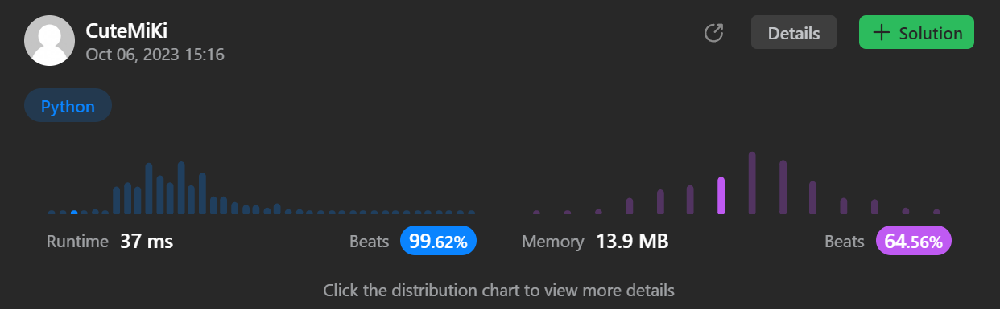

# 332. Reconstruct Itinerary
### Tag: [Hard](https://github.com/TheOnlyMiki/LeetCode-For-Fun/tree/main#hard-level), [Depth-First Search](https://github.com/TheOnlyMiki/LeetCode-For-Fun/tree/main#depth-first-search), [Graph](https://github.com/TheOnlyMiki/LeetCode-For-Fun/tree/main#graph)
---
<div class="px-5 pt-4"><div class="flex"></div><div class="xFUwe" data-track-load="description_content"><p>You are given a list of airline <code>tickets</code> where <code>tickets[i] = [from<sub>i</sub>, to<sub>i</sub>]</code> represent the departure and the arrival airports of one flight. Reconstruct the itinerary in order and return it.</p>

<p>All of the tickets belong to a man who departs from <code>"JFK"</code>, thus, the itinerary must begin with <code>"JFK"</code>. If there are multiple valid itineraries, you should return the itinerary that has the smallest lexical order when read as a single string.</p>

<ul>
	<li>For example, the itinerary <code>["JFK", "LGA"]</code> has a smaller lexical order than <code>["JFK", "LGB"]</code>.</li>
</ul>

<p>You may assume all tickets form at least one valid itinerary. You must use all the tickets once and only once.</p>

<p>&nbsp;</p>
<p><strong class="example">Example 1:</strong></p>

<pre><strong>Input:</strong> tickets = [["MUC","LHR"],["JFK","MUC"],["SFO","SJC"],["LHR","SFO"]]
<strong>Output:</strong> ["JFK","MUC","LHR","SFO","SJC"]
</pre>

<p><strong class="example">Example 2:</strong></p>

<pre><strong>Input:</strong> tickets = [["JFK","SFO"],["JFK","ATL"],["SFO","ATL"],["ATL","JFK"],["ATL","SFO"]]
<strong>Output:</strong> ["JFK","ATL","JFK","SFO","ATL","SFO"]
<strong>Explanation:</strong> Another possible reconstruction is ["JFK","SFO","ATL","JFK","ATL","SFO"] but it is larger in lexical order.
</pre>

<p>&nbsp;</p>
<p><strong>Constraints:</strong></p>

<ul>
	<li><code>1 &lt;= tickets.length &lt;= 300</code></li>
	<li><code>tickets[i].length == 2</code></li>
	<li><code>from<sub>i</sub>.length == 3</code></li>
	<li><code>to<sub>i</sub>.length == 3</code></li>
	<li><code>from<sub>i</sub></code> and <code>to<sub>i</sub></code> consist of uppercase English letters.</li>
	<li><code>from<sub>i</sub> != to<sub>i</sub></code></li>
</ul>
</div></div>

---


### Solution

```python
class Solution(object):
    def findItinerary(self, tickets):
        """
        :type tickets: List[List[str]]
        :rtype: List[str]
        """
        # Option 2
        record = {}
        for start, end in tickets:
            if start in record:
                record[start].append(end)
            else:
                record[start] = [end]

        for key in record.keys():
            record[key].sort()
            record[key].reverse()
        
        def dfs(cameFrom):
            if cameFrom in record:
                while record[cameFrom]:
                    dfs(record[cameFrom].pop())

            self.output.append(cameFrom)

        self.output = []
        dfs("JFK")
        return self.output[::-1]

        # Option 1
        """
        total = len(tickets) + 1
        order = set()
        record = {}
        for start, end in tickets:
            order |= {start, end}
            if start in record:
                record[start][end] = record[start][end] + 1 if end in record[start] else 1
            else:
                record[start] = {end:1}

        order = sorted(order)
        
        def dfs(store, cameFrom):
            if len(store) == total:
                self.output = store[:]
                return True

            if cameFrom in record:
                for city in order:
                    if city in record[cameFrom] and record[cameFrom][city] != 0:
                        record[cameFrom][city] -= 1
                        if dfs(store + [city], city):
                            return True
                        record[cameFrom][city] += 1

            return False

        self.output = None
        dfs(["JFK"], "JFK")
        return self.output
        """
```
