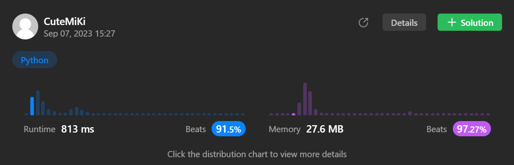

# 334. Increasing Triplet Subsequence
### Tag: [Medium](https://github.com/TheOnlyMiki/LeetCode-For-Fun/tree/main#medium-level), [Array](https://github.com/TheOnlyMiki/LeetCode-For-Fun/tree/main#array), [Greedy](https://github.com/TheOnlyMiki/LeetCode-For-Fun/tree/main#greedy)
---
<div class="px-5 pt-4"><div class="flex"></div><div class="xFUwe" data-track-load="description_content"><p>Given an integer array <code>nums</code>, return <code>true</code><em> if there exists a triple of indices </em><code>(i, j, k)</code><em> such that </em><code>i &lt; j &lt; k</code><em> and </em><code>nums[i] &lt; nums[j] &lt; nums[k]</code>. If no such indices exists, return <code>false</code>.</p>

<p>&nbsp;</p>
<p><strong class="example">Example 1:</strong></p>

<pre><strong>Input:</strong> nums = [1,2,3,4,5]
<strong>Output:</strong> true
<strong>Explanation:</strong> Any triplet where i &lt; j &lt; k is valid.
</pre>

<p><strong class="example">Example 2:</strong></p>

<pre><strong>Input:</strong> nums = [5,4,3,2,1]
<strong>Output:</strong> false
<strong>Explanation:</strong> No triplet exists.
</pre>

<p><strong class="example">Example 3:</strong></p>

<pre><strong>Input:</strong> nums = [2,1,5,0,4,6]
<strong>Output:</strong> true
<strong>Explanation:</strong> The triplet (3, 4, 5) is valid because nums[3] == 0 &lt; nums[4] == 4 &lt; nums[5] == 6.
</pre>

<p>&nbsp;</p>
<p><strong>Constraints:</strong></p>

<ul>
	<li><code>1 &lt;= nums.length &lt;= 5 * 10<sup>5</sup></code></li>
	<li><code>-2<sup>31</sup> &lt;= nums[i] &lt;= 2<sup>31</sup> - 1</code></li>
</ul>

<p>&nbsp;</p>
<strong>Follow up:</strong> Could you implement a solution that runs in <code>O(n)</code> time complexity and <code>O(1)</code> space complexity?</div></div>

---


### Solution

```python
class Solution(object):
    def increasingTriplet(self, nums):
        """
        :type nums: List[int]
        :rtype: bool
        """
        # Option 2
        min1 = min2 = 2**31
        for num in nums:
            if num <= min1:
                min1 = num
            elif num <= min2:
                min2 = num
            else:
                return True

        return False

        # Option 1 - Find the maximum increasing subarray
        """
        def insertMostLeft(a, x):
            left, right, mid = 0, len(a), None
            while left < right:
                mid = (left + right) / 2
                if a[mid] < x: 
                    left = mid + 1
                else: 
                    right = mid
            return left

        record = []
        temp = None

        for num in nums:
            if not record or record[-1] < num:
                record.append(num)
            else:
                record[insertMostLeft(record, num)] = num
        
        return len(record) > 2
        """
```
