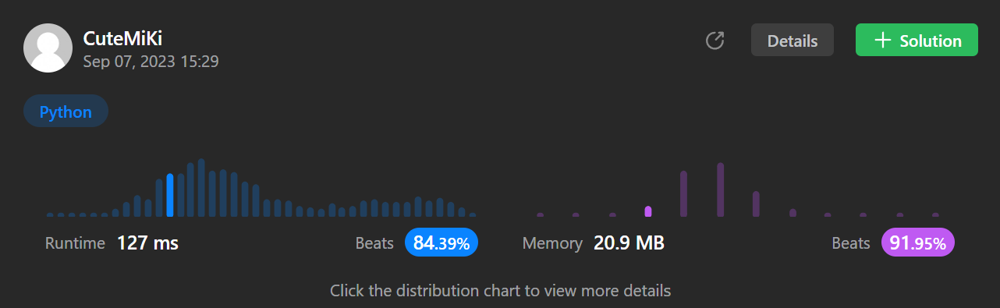

# 344. Reverse String
### Tag: [Easy](https://github.com/TheOnlyMiki/LeetCode-For-Fun/tree/main#easy-level), [Two Pointers](https://github.com/TheOnlyMiki/LeetCode-For-Fun/tree/main#two-pointers), [String](https://github.com/TheOnlyMiki/LeetCode-For-Fun/tree/main#string)
---
<div class="px-5 pt-4"><div class="flex"></div><div class="xFUwe" data-track-load="description_content"><p>Write a function that reverses a string. The input string is given as an array of characters <code>s</code>.</p>

<p>You must do this by modifying the input array <a href="https://en.wikipedia.org/wiki/In-place_algorithm" target="_blank">in-place</a> with <code>O(1)</code> extra memory.</p>

<p>&nbsp;</p>
<p><strong class="example">Example 1:</strong></p>
<pre><strong>Input:</strong> s = ["h","e","l","l","o"]
<strong>Output:</strong> ["o","l","l","e","h"]
</pre><p><strong class="example">Example 2:</strong></p>
<pre><strong>Input:</strong> s = ["H","a","n","n","a","h"]
<strong>Output:</strong> ["h","a","n","n","a","H"]
</pre>
<p>&nbsp;</p>
<p><strong>Constraints:</strong></p>

<ul>
	<li><code>1 &lt;= s.length &lt;= 10<sup>5</sup></code></li>
	<li><code>s[i]</code> is a <a href="https://en.wikipedia.org/wiki/ASCII#Printable_characters" target="_blank">printable ascii character</a>.</li>
</ul>
</div></div>

---


### Solution

```python
class Solution(object):
    def reverseString(self, s):
        """
        :type s: List[str]
        :rtype: None Do not return anything, modify s in-place instead.
        """
        left, right = 0, len(s)-1
        while left < right:
            s[left], s[right] = s[right], s[left]
            left += 1
            right -= 1
```
