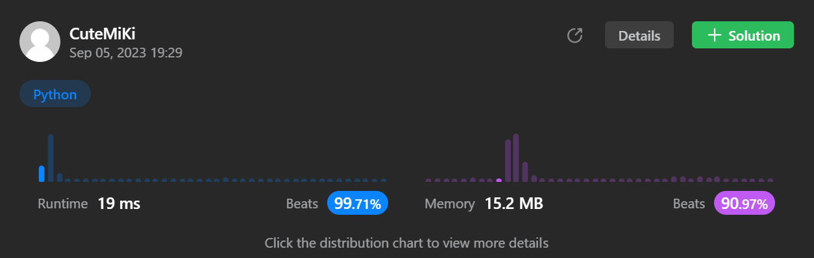

# 345. Reverse Vowels of a String
### Tag: [Easy](https://github.com/TheOnlyMiki/LeetCode-For-Fun/tree/main#easy-level), [Two Pointers](https://github.com/TheOnlyMiki/LeetCode-For-Fun/tree/main#two-pointers), [String](https://github.com/TheOnlyMiki/LeetCode-For-Fun/tree/main#string)
---
<div class="px-5 pt-4"><div class="flex"></div><div class="xFUwe" data-track-load="description_content"><p>Given a string <code>s</code>, reverse only all the vowels in the string and return it.</p>

<p>The vowels are <code>'a'</code>, <code>'e'</code>, <code>'i'</code>, <code>'o'</code>, and <code>'u'</code>, and they can appear in both lower and upper cases, more than once.</p>

<p>&nbsp;</p>
<p><strong class="example">Example 1:</strong></p>
<pre><strong>Input:</strong> s = "hello"
<strong>Output:</strong> "holle"
</pre><p><strong class="example">Example 2:</strong></p>
<pre><strong>Input:</strong> s = "leetcode"
<strong>Output:</strong> "leotcede"
</pre>
<p>&nbsp;</p>
<p><strong>Constraints:</strong></p>

<ul>
	<li><code>1 &lt;= s.length &lt;= 3 * 10<sup>5</sup></code></li>
	<li><code>s</code> consist of <strong>printable ASCII</strong> characters.</li>
</ul>
</div></div>

---


### Solution

```python
class Solution(object):
    def reverseVowels(self, s):
        """
        :type s: str
        :rtype: str
        """
        s = list(s)
        target = {'a', 'e', 'i', 'o', 'u', 'A', 'E', 'I', 'O', 'U'}
        left, right = 0, len(s)-1

        while left < right:
            while left < right and s[left] not in target:
                left += 1

            while left < right and s[right] not in target:
                right -= 1

            s[left], s[right] = s[right], s[left]
            left += 1
            right -= 1

        return ''.join(s)
```
