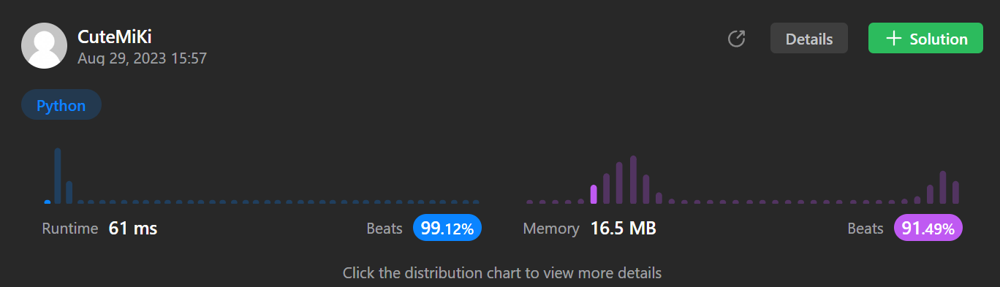

# 347. Top K Frequent Elements
### Tag: [Medium](https://github.com/TheOnlyMiki/LeetCode-For-Fun/tree/main#medium-level), [Array](https://github.com/TheOnlyMiki/LeetCode-For-Fun/tree/main#array), [Hash Table](https://github.com/TheOnlyMiki/LeetCode-For-Fun/tree/main#hash-table), [Divide and Conquer](https://github.com/TheOnlyMiki/LeetCode-For-Fun/tree/main#divide-and-conquer), [Sorting](https://github.com/TheOnlyMiki/LeetCode-For-Fun/tree/main#sorting), [Queue](https://github.com/TheOnlyMiki/LeetCode-For-Fun/tree/main#queue), [Counting](https://github.com/TheOnlyMiki/LeetCode-For-Fun/tree/main#counting)
---
<div class="px-5 pt-4"><div class="flex"></div><div class="xFUwe" data-track-load="description_content"><p>Given an integer array <code>nums</code> and an integer <code>k</code>, return <em>the</em> <code>k</code> <em>most frequent elements</em>. You may return the answer in <strong>any order</strong>.</p>

<p>&nbsp;</p>
<p><strong class="example">Example 1:</strong></p>
<pre><strong>Input:</strong> nums = [1,1,1,2,2,3], k = 2
<strong>Output:</strong> [1,2]
</pre><p><strong class="example">Example 2:</strong></p>
<pre><strong>Input:</strong> nums = [1], k = 1
<strong>Output:</strong> [1]
</pre>
<p>&nbsp;</p>
<p><strong>Constraints:</strong></p>

<ul>
	<li><code>1 &lt;= nums.length &lt;= 10<sup>5</sup></code></li>
	<li><code>-10<sup>4</sup> &lt;= nums[i] &lt;= 10<sup>4</sup></code></li>
	<li><code>k</code> is in the range <code>[1, the number of unique elements in the array]</code>.</li>
	<li>It is <strong>guaranteed</strong> that the answer is <strong>unique</strong>.</li>
</ul>

<p>&nbsp;</p>
<p><strong>Follow up:</strong> Your algorithm's time complexity must be better than <code>O(n log n)</code>, where n is the array's size.</p>
</div></div>

---


### Solution

```python
class Solution(object):
    def topKFrequent(self, nums, k):
        """
        :type nums: List[int]
        :type k: int
        :rtype: List[int]
        """
        record = {}
        for num in nums:
            if num in record:
                record[num] += 1
            else:
                record[num] = 1

        record = sorted(record.items(), key=(lambda x:x[1]))

        output = []
        for _ in range(k):
            output.append(record.pop()[0])

        return output
```
