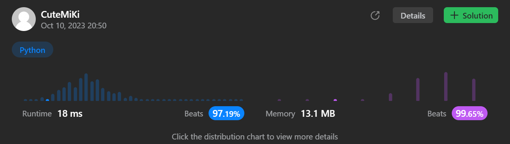

# 349. Intersection of Two Arrays
### Tag: [Easy](https://github.com/TheOnlyMiki/LeetCode-For-Fun/tree/main#easy-level), [Array](https://github.com/TheOnlyMiki/LeetCode-For-Fun/tree/main#array), [Hash Table](https://github.com/TheOnlyMiki/LeetCode-For-Fun/tree/main#hash-table), [Two Pointers](https://github.com/TheOnlyMiki/LeetCode-For-Fun/tree/main#two-pointers), [Binary Search](https://github.com/TheOnlyMiki/LeetCode-For-Fun/tree/main#binary-search), [Sorting](https://github.com/TheOnlyMiki/LeetCode-For-Fun/tree/main#sorting)
---
<div class="px-5 pt-4"><div class="flex"></div><div class="xFUwe" data-track-load="description_content"><p>Given two integer arrays <code>nums1</code> and <code>nums2</code>, return <em>an array of their intersection</em>. Each element in the result must be <strong>unique</strong> and you may return the result in <strong>any order</strong>.</p>

<p>&nbsp;</p>
<p><strong class="example">Example 1:</strong></p>

<pre><strong>Input:</strong> nums1 = [1,2,2,1], nums2 = [2,2]
<strong>Output:</strong> [2]
</pre>

<p><strong class="example">Example 2:</strong></p>

<pre><strong>Input:</strong> nums1 = [4,9,5], nums2 = [9,4,9,8,4]
<strong>Output:</strong> [9,4]
<strong>Explanation:</strong> [4,9] is also accepted.
</pre>

<p>&nbsp;</p>
<p><strong>Constraints:</strong></p>

<ul>
	<li><code>1 &lt;= nums1.length, nums2.length &lt;= 1000</code></li>
	<li><code>0 &lt;= nums1[i], nums2[i] &lt;= 1000</code></li>
</ul>
</div></div>

---


### Solution

```python
class Solution(object):
    def intersection(self, nums1, nums2):
        """
        :type nums1: List[int]
        :type nums2: List[int]
        :rtype: List[int]
        """
        # Option 2 - Sorting and Binary Search
        nums1.sort()
        nums2.sort()
        output = set()
        i, j = 0, 0
        while i < len(nums1) and j < len(nums2):
            if nums1[i] < nums2[j]:
                i += 1
            elif nums1[i] > nums2[j]:
                j += 1
            else:
                output.add(nums1[i])
                i, j = i+1, j+1

        return list(output)

        # Option 1 - Insert Set
        return list(set(nums1) & set(nums2))
```
