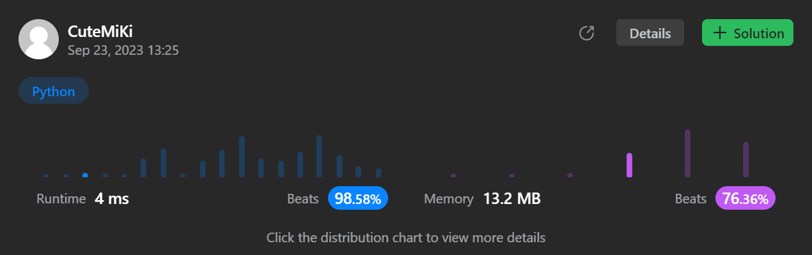

# 374. Guess Number Higher or Lower
### Tag: [Easy](https://github.com/TheOnlyMiki/LeetCode-For-Fun/tree/main#easy-level), [Binary Search](https://github.com/TheOnlyMiki/LeetCode-For-Fun/tree/main#binary-search)
---
<div class="px-5 pt-4"><div class="flex"></div><div class="xFUwe" data-track-load="description_content"><p>We are playing the Guess Game. The game is as follows:</p>

<p>I pick a number from <code>1</code> to <code>n</code>. You have to guess which number I picked.</p>

<p>Every time you guess wrong, I will tell you whether the number I picked is higher or lower than your guess.</p>

<p>You call a pre-defined API <code>int guess(int num)</code>, which returns three possible results:</p>

<ul>
	<li><code>-1</code>: Your guess is higher than the number I picked (i.e. <code>num &gt; pick</code>).</li>
	<li><code>1</code>: Your guess is lower than the number I picked (i.e. <code>num &lt; pick</code>).</li>
	<li><code>0</code>: your guess is equal to the number I picked (i.e. <code>num == pick</code>).</li>
</ul>

<p>Return <em>the number that I picked</em>.</p>

<p>&nbsp;</p>
<p><strong class="example">Example 1:</strong></p>

<pre><strong>Input:</strong> n = 10, pick = 6
<strong>Output:</strong> 6
</pre>

<p><strong class="example">Example 2:</strong></p>

<pre><strong>Input:</strong> n = 1, pick = 1
<strong>Output:</strong> 1
</pre>

<p><strong class="example">Example 3:</strong></p>

<pre><strong>Input:</strong> n = 2, pick = 1
<strong>Output:</strong> 1
</pre>

<p>&nbsp;</p>
<p><strong>Constraints:</strong></p>

<ul>
	<li><code>1 &lt;= n &lt;= 2<sup>31</sup> - 1</code></li>
	<li><code>1 &lt;= pick &lt;= n</code></li>
</ul>
</div></div>

---


### Solution

```python
# The guess API is already defined for you.
# @param num, your guess
# @return -1 if num is higher than the picked number
#          1 if num is lower than the picked number
#          otherwise return 0
# def guess(num):

class Solution(object):
    def guessNumber(self, n):
        """
        :type n: int
        :rtype: int
        """
        left = 1
        while left <= n:
            mid = (left + n) // 2
            temp = guess(mid)
            if temp == -1:
                n = mid - 1
            elif temp == 1:
                left = mid + 1
            else:
                return mid

        return -1
```
