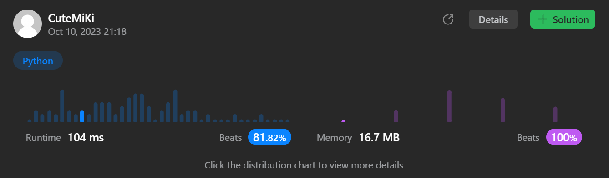

# 384. Shuffle an Array
### Tag: [Medium](https://github.com/TheOnlyMiki/LeetCode-For-Fun/tree/main#medium-level), [Array](https://github.com/TheOnlyMiki/LeetCode-For-Fun/tree/main#array), [Math](https://github.com/TheOnlyMiki/LeetCode-For-Fun/tree/main#math), [Randomized](https://github.com/TheOnlyMiki/LeetCode-For-Fun/tree/main#randomized)
---
<div class="px-5 pt-4"><div class="flex"></div><div class="xFUwe" data-track-load="description_content"><p>Given an integer array <code>nums</code>, design an algorithm to randomly shuffle the array. All permutations of the array should be <strong>equally likely</strong> as a result of the shuffling.</p>

<p>Implement the <code>Solution</code> class:</p>

<ul>
	<li><code>Solution(int[] nums)</code> Initializes the object with the integer array <code>nums</code>.</li>
	<li><code>int[] reset()</code> Resets the array to its original configuration and returns it.</li>
	<li><code>int[] shuffle()</code> Returns a random shuffling of the array.</li>
</ul>

<p>&nbsp;</p>
<p><strong class="example">Example 1:</strong></p>

<pre><strong>Input</strong>
["Solution", "shuffle", "reset", "shuffle"]
[[[1, 2, 3]], [], [], []]
<strong>Output</strong>
[null, [3, 1, 2], [1, 2, 3], [1, 3, 2]]

<strong>Explanation</strong>
Solution solution = new Solution([1, 2, 3]);
solution.shuffle();    // Shuffle the array [1,2,3] and return its result.
                       // Any permutation of [1,2,3] must be equally likely to be returned.
                       // Example: return [3, 1, 2]
solution.reset();      // Resets the array back to its original configuration [1,2,3]. Return [1, 2, 3]
solution.shuffle();    // Returns the random shuffling of array [1,2,3]. Example: return [1, 3, 2]

</pre>

<p>&nbsp;</p>
<p><strong>Constraints:</strong></p>

<ul>
	<li><code>1 &lt;= nums.length &lt;= 50</code></li>
	<li><code>-10<sup>6</sup> &lt;= nums[i] &lt;= 10<sup>6</sup></code></li>
	<li>All the elements of <code>nums</code> are <strong>unique</strong>.</li>
	<li>At most <code>10<sup>4</sup></code> calls <strong>in total</strong> will be made to <code>reset</code> and <code>shuffle</code>.</li>
</ul>
</div></div>

---


### Solution

```python
class Solution(object):

    def __init__(self, nums):
        """
        :type nums: List[int]
        """
        self.origin = nums[:]
        self.store = nums[:]

    def reset(self):
        """
        :rtype: List[int]
        """
        return self.origin

    def shuffle(self):
        """
        :rtype: List[int]
        """
        length = len(self.store)-1
        for i in range(length):
            swap_i = random.randint(i, length)
            self.store[i], self.store[swap_i] = self.store[swap_i], self.store[i]

        return self.store


# Your Solution object will be instantiated and called as such:
# obj = Solution(nums)
# param_1 = obj.reset()
# param_2 = obj.shuffle()
```
