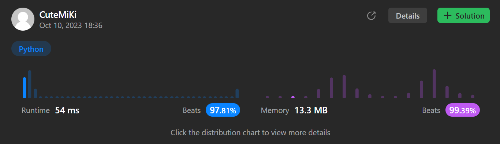

# 387. First Unique Character in a String
### Tag: [Easy](https://github.com/TheOnlyMiki/LeetCode-For-Fun/tree/main#easy-level), [Hash Table](https://github.com/TheOnlyMiki/LeetCode-For-Fun/tree/main#hash-table), [String](https://github.com/TheOnlyMiki/LeetCode-For-Fun/tree/main#string), [Queue](https://github.com/TheOnlyMiki/LeetCode-For-Fun/tree/main#queue), [Counting](https://github.com/TheOnlyMiki/LeetCode-For-Fun/tree/main#counting)
---
<div class="px-5 pt-4"><div class="flex"></div><div class="xFUwe" data-track-load="description_content"><p>Given a string <code>s</code>, <em>find the first non-repeating character in it and return its index</em>. If it does not exist, return <code>-1</code>.</p>

<p>&nbsp;</p>
<p><strong class="example">Example 1:</strong></p>
<pre><strong>Input:</strong> s = "leetcode"
<strong>Output:</strong> 0
</pre><p><strong class="example">Example 2:</strong></p>
<pre><strong>Input:</strong> s = "loveleetcode"
<strong>Output:</strong> 2
</pre><p><strong class="example">Example 3:</strong></p>
<pre><strong>Input:</strong> s = "aabb"
<strong>Output:</strong> -1
</pre>
<p>&nbsp;</p>
<p><strong>Constraints:</strong></p>

<ul>
	<li><code>1 &lt;= s.length &lt;= 10<sup>5</sup></code></li>
	<li><code>s</code> consists of only lowercase English letters.</li>
</ul>
</div></div>

---


### Solution

```python
class Solution(object):
    def firstUniqChar(self, s):
        """
        :type s: str
        :rtype: int
        """
        record = {}
        for i, c in enumerate(s):
            record[c] = -1 if c in record else i

        output = len(s)
        for num in record.values():
            if -1 < num < output:
                output = num
        
        return -1 if output == len(s) else output
```
