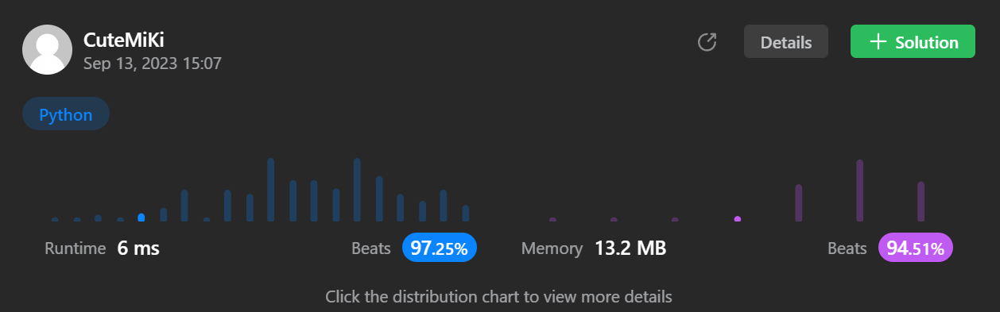

# 394. Decode String
### Tag: [Medium](https://github.com/TheOnlyMiki/LeetCode-For-Fun/tree/main#medium-level), [String](https://github.com/TheOnlyMiki/LeetCode-For-Fun/tree/main#string), [Stack](https://github.com/TheOnlyMiki/LeetCode-For-Fun/tree/main#stack)
---
<div class="px-5 pt-4"><div class="flex"></div><div class="xFUwe" data-track-load="description_content"><p>Given an encoded string, return its decoded string.</p>

<p>The encoding rule is: <code>k[encoded_string]</code>, where the <code>encoded_string</code> inside the square brackets is being repeated exactly <code>k</code> times. Note that <code>k</code> is guaranteed to be a positive integer.</p>

<p>You may assume that the input string is always valid; there are no extra white spaces, square brackets are well-formed, etc. Furthermore, you may assume that the original data does not contain any digits and that digits are only for those repeat numbers, <code>k</code>. For example, there will not be input like <code>3a</code> or <code>2[4]</code>.</p>

<p>The test cases are generated so that the length of the output will never exceed <code>10<sup>5</sup></code>.</p>

<p>&nbsp;</p>
<p><strong class="example">Example 1:</strong></p>

<pre><strong>Input:</strong> s = "3[a]2[bc]"
<strong>Output:</strong> "aaabcbc"
</pre>

<p><strong class="example">Example 2:</strong></p>

<pre><strong>Input:</strong> s = "3[a2[c]]"
<strong>Output:</strong> "accaccacc"
</pre>

<p><strong class="example">Example 3:</strong></p>

<pre><strong>Input:</strong> s = "2[abc]3[cd]ef"
<strong>Output:</strong> "abcabccdcdcdef"
</pre>

<p>&nbsp;</p>
<p><strong>Constraints:</strong></p>

<ul>
	<li><code>1 &lt;= s.length &lt;= 30</code></li>
	<li><code>s</code> consists of lowercase English letters, digits, and square brackets <code>'[]'</code>.</li>
	<li><code>s</code> is guaranteed to be <strong>a valid</strong> input.</li>
	<li>All the integers in <code>s</code> are in the range <code>[1, 300]</code>.</li>
</ul>
</div></div>
---


### Solution

```python
class Solution(object):
    def decodeString(self, s):
        """
        :type s: str
        :rtype: str
        """
        stack = []
        represent_nums = {c for c in "0123456789"}
        time = word = None

        for c in s:
            if c == ']':
                time, word = "", ""
                while stack[-1] != '[':
                    word = stack.pop() + word

                stack.pop()
                while stack and stack[-1] in represent_nums:
                    time = stack.pop() + time

                stack.append(int(time) * word)
            else:
                stack.append(c)

        return ''.join(stack)
```
