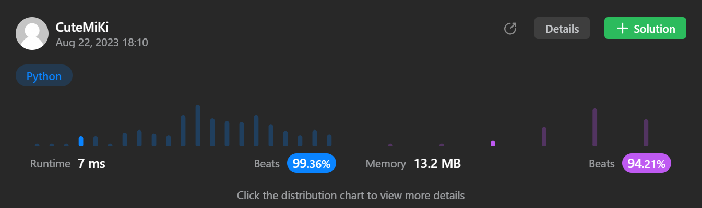

# 399. Evaluate Division
### Tag: [Medium](https://github.com/TheOnlyMiki/LeetCode-For-Fun/tree/main#medium-level), [Array](https://github.com/TheOnlyMiki/LeetCode-For-Fun/tree/main#array), [Depth-First Search](https://github.com/TheOnlyMiki/LeetCode-For-Fun/tree/main#depth-first-search), [Breadth-First Search](https://github.com/TheOnlyMiki/LeetCode-For-Fun/tree/main#breadth-first-search), [Union Find](https://github.com/TheOnlyMiki/LeetCode-For-Fun/tree/main#union-find), [Graph](https://github.com/TheOnlyMiki/LeetCode-For-Fun/tree/main#graph)
---
<div class="px-5 pt-4"><div class="flex"></div><div class="xFUwe" data-track-load="description_content"><p>You are given an array of variable pairs <code>equations</code> and an array of real numbers <code>values</code>, where <code>equations[i] = [A<sub>i</sub>, B<sub>i</sub>]</code> and <code>values[i]</code> represent the equation <code>A<sub>i</sub> / B<sub>i</sub> = values[i]</code>. Each <code>A<sub>i</sub></code> or <code>B<sub>i</sub></code> is a string that represents a single variable.</p>

<p>You are also given some <code>queries</code>, where <code>queries[j] = [C<sub>j</sub>, D<sub>j</sub>]</code> represents the <code>j<sup>th</sup></code> query where you must find the answer for <code>C<sub>j</sub> / D<sub>j</sub> = ?</code>.</p>

<p>Return <em>the answers to all queries</em>. If a single answer cannot be determined, return <code>-1.0</code>.</p>

<p><strong>Note:</strong> The input is always valid. You may assume that evaluating the queries will not result in division by zero and that there is no contradiction.</p>

<p><strong>Note:&nbsp;</strong>The variables that do not occur in the list of equations are undefined, so the answer cannot be determined for them.</p>

<p>&nbsp;</p>
<p><strong class="example">Example 1:</strong></p>

<pre><strong>Input:</strong> equations = [["a","b"],["b","c"]], values = [2.0,3.0], queries = [["a","c"],["b","a"],["a","e"],["a","a"],["x","x"]]
<strong>Output:</strong> [6.00000,0.50000,-1.00000,1.00000,-1.00000]
<strong>Explanation:</strong> 
Given: <em>a / b = 2.0</em>, <em>b / c = 3.0</em>
queries are: <em>a / c = ?</em>, <em>b / a = ?</em>, <em>a / e = ?</em>, <em>a / a = ?</em>, <em>x / x = ? </em>
return: [6.0, 0.5, -1.0, 1.0, -1.0 ]
note: x is undefined =&gt; -1.0</pre>

<p><strong class="example">Example 2:</strong></p>

<pre><strong>Input:</strong> equations = [["a","b"],["b","c"],["bc","cd"]], values = [1.5,2.5,5.0], queries = [["a","c"],["c","b"],["bc","cd"],["cd","bc"]]
<strong>Output:</strong> [3.75000,0.40000,5.00000,0.20000]
</pre>

<p><strong class="example">Example 3:</strong></p>

<pre><strong>Input:</strong> equations = [["a","b"]], values = [0.5], queries = [["a","b"],["b","a"],["a","c"],["x","y"]]
<strong>Output:</strong> [0.50000,2.00000,-1.00000,-1.00000]
</pre>

<p>&nbsp;</p>
<p><strong>Constraints:</strong></p>

<ul>
	<li><code>1 &lt;= equations.length &lt;= 20</code></li>
	<li><code>equations[i].length == 2</code></li>
	<li><code>1 &lt;= A<sub>i</sub>.length, B<sub>i</sub>.length &lt;= 5</code></li>
	<li><code>values.length == equations.length</code></li>
	<li><code>0.0 &lt; values[i] &lt;= 20.0</code></li>
	<li><code>1 &lt;= queries.length &lt;= 20</code></li>
	<li><code>queries[i].length == 2</code></li>
	<li><code>1 &lt;= C<sub>j</sub>.length, D<sub>j</sub>.length &lt;= 5</code></li>
	<li><code>A<sub>i</sub>, B<sub>i</sub>, C<sub>j</sub>, D<sub>j</sub></code> consist of lower case English letters and digits.</li>
</ul>
</div></div>

---


### Solution

```python
class Solution(object):
    def calcEquation(self, equations, values, queries):
        """
        :type equations: List[List[str]]
        :type values: List[float]
        :type queries: List[List[str]]
        :rtype: List[float]
        """
        # Option 2
        record = {}
        connect = {}
        visit = set()

        def updateConnect(symbol1, symbol2):
            if symbol1 not in connect:
                connect[symbol1] = {symbol1}
            if symbol2 not in connect:
                connect[symbol2] = {symbol2}

            temp = connect[symbol1] | connect[symbol2]
            for s in temp:
                connect[s] = temp

        def getResult(sym1, sym2, value):
            if sym2 in record[sym1]:
                return value * record[sym1][sym2]

            visit.add(sym1)
            for sym in record[sym1]:
                if sym not in visit:
                    temp = getResult(sym, sym2, value * record[sym1][sym])
                    if temp:
                        return temp
                
            visit.remove(sym1)
            return None

        com1 = com2 = None
        for i, (x1, x2) in enumerate(equations):
            if x1 not in record:
                record[x1] = {}
            if x2 not in record:
                record[x2] = {}

            record[x1][x2] = values[i]
            record[x2][x1] = 1/values[i]
            updateConnect(x1, x2)

        output = []
        for i, (x1, x2) in enumerate(queries):
            if x1 in record and x2 in record and x1 in connect[x2]:
                if x1 == x2:
                    output.append(1.0)
                else:
                    visit.clear()
                    output.append(getResult(x1, x2, 1))
            else:
                output.append(-1.0)

        return output

        # Option 1 - Can't pass, because this not accury
        """
        equations = sorted(zip(equations, values), key=(lambda x:x[0][1]))

        record = {}
        connect = {}
        product = 3000

        def updateConnect(symbol, symbol2):
            if symbol not in connect:
                temp = {symbol} | connect[symbol2]
            elif symbol2 not in connect:
                temp = {symbol2} | connect[symbol]
            else:
                temp = connect[symbol] | connect[symbol2]

            for s in temp:
                connect[s] = temp

        for i, (x,y) in enumerate(equations):
            symbol, symbol2 = (x[0] in record), (x[1] in record)
            if not symbol and not symbol2:
                record[x[1]] = product
                record[x[0]] = y * product
                connect[x[0]] = connect[x[1]] = set([x[1], x[0]])
            elif symbol:
                record[x[1]] = record[x[0]] / y
                updateConnect(x[0], x[1])
            elif symbol2:
                record[x[0]] = record[x[1]] * y
                updateConnect(x[0], x[1])
            else:
                updateConnect(x[0], x[1])

        output = []
                
        for i, x in enumerate(queries):
            if x[0] not in record or x[1] not in record or x[0] not in connect[x[1]]:
                output.append(-1.0)
            else:
                output.append(record[x[0]] / record[x[1]])

        return output
        """
```
