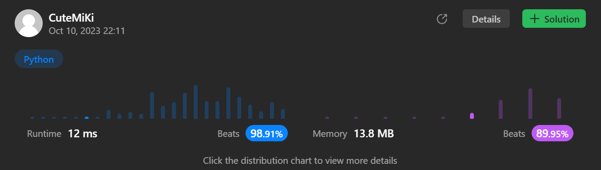

# 412. Fizz Buzz
### Tag: [Easy](https://github.com/TheOnlyMiki/LeetCode-For-Fun/tree/main#easy-level), [Math](https://github.com/TheOnlyMiki/LeetCode-For-Fun/tree/main#math), [String](https://github.com/TheOnlyMiki/LeetCode-For-Fun/tree/main#string)
---
<div class="px-5 pt-4"><div class="flex"></div><div class="xFUwe" data-track-load="description_content"><p>Given an integer <code>n</code>, return <em>a string array </em><code>answer</code><em> (<strong>1-indexed</strong>) where</em>:</p>

<ul>
	<li><code>answer[i] == "FizzBuzz"</code> if <code>i</code> is divisible by <code>3</code> and <code>5</code>.</li>
	<li><code>answer[i] == "Fizz"</code> if <code>i</code> is divisible by <code>3</code>.</li>
	<li><code>answer[i] == "Buzz"</code> if <code>i</code> is divisible by <code>5</code>.</li>
	<li><code>answer[i] == i</code> (as a string) if none of the above conditions are true.</li>
</ul>

<p>&nbsp;</p>
<p><strong class="example">Example 1:</strong></p>
<pre><strong>Input:</strong> n = 3
<strong>Output:</strong> ["1","2","Fizz"]
</pre><p><strong class="example">Example 2:</strong></p>
<pre><strong>Input:</strong> n = 5
<strong>Output:</strong> ["1","2","Fizz","4","Buzz"]
</pre><p><strong class="example">Example 3:</strong></p>
<pre><strong>Input:</strong> n = 15
<strong>Output:</strong> ["1","2","Fizz","4","Buzz","Fizz","7","8","Fizz","Buzz","11","Fizz","13","14","FizzBuzz"]
</pre>
<p>&nbsp;</p>
<p><strong>Constraints:</strong></p>

<ul>
	<li><code>1 &lt;= n &lt;= 10<sup>4</sup></code></li>
</ul>
</div></div>

---


### Solution

```python
class Solution(object):
    def fizzBuzz(self, n):
        """
        :type n: int
        :rtype: List[str]
        """
        # Option 2 - Math Method
        record = []
        for i in range(1, n+1):
            if i % 15 == 0:
                record.append("FizzBuzz")
            elif i % 3 == 0:
                record.append("Fizz")
            elif i % 5 == 0:
                record.append("Buzz")
            else:
                record.append(str(i))

        return record

        # Option 1 - Dynamic Programming Method
        """
        record = ["1", "2", "Fizz", "4", "Buzz"]
        for i in range(5, n):
            count = ""
            if record[i-3][0] == 'F':
                count += "Fizz"
            if record[i-5][0] == 'B' or len(record[i-5]) == 8:
                count += "Buzz"

            record.append(count if count else str(i+1))
            
        return record if n > 4 else record[:n]
        """
```
