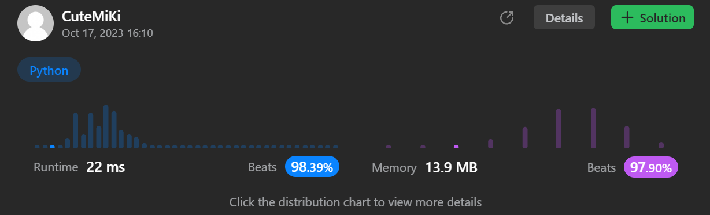

# 414. Third Maximum Number
### Tag: [Easy](https://github.com/TheOnlyMiki/LeetCode-For-Fun/tree/main#easy-level), [Array](https://github.com/TheOnlyMiki/LeetCode-For-Fun/tree/main#array), [Sorting](https://github.com/TheOnlyMiki/LeetCode-For-Fun/tree/main#sorting)
---
<div class="px-5 pt-4"><div class="flex"></div><div class="xFUwe" data-track-load="description_content"><p>Given an integer array <code>nums</code>, return <em>the <strong>third distinct maximum</strong> number in this array. If the third maximum does not exist, return the <strong>maximum</strong> number</em>.</p>

<p>&nbsp;</p>
<p><strong class="example">Example 1:</strong></p>

<pre><strong>Input:</strong> nums = [3,2,1]
<strong>Output:</strong> 1
<strong>Explanation:</strong>
The first distinct maximum is 3.
The second distinct maximum is 2.
The third distinct maximum is 1.
</pre>

<p><strong class="example">Example 2:</strong></p>

<pre><strong>Input:</strong> nums = [1,2]
<strong>Output:</strong> 2
<strong>Explanation:</strong>
The first distinct maximum is 2.
The second distinct maximum is 1.
The third distinct maximum does not exist, so the maximum (2) is returned instead.
</pre>

<p><strong class="example">Example 3:</strong></p>

<pre><strong>Input:</strong> nums = [2,2,3,1]
<strong>Output:</strong> 1
<strong>Explanation:</strong>
The first distinct maximum is 3.
The second distinct maximum is 2 (both 2's are counted together since they have the same value).
The third distinct maximum is 1.
</pre>

<p>&nbsp;</p>
<p><strong>Constraints:</strong></p>

<ul>
	<li><code>1 &lt;= nums.length &lt;= 10<sup>4</sup></code></li>
	<li><code>-2<sup>31</sup> &lt;= nums[i] &lt;= 2<sup>31</sup> - 1</code></li>
</ul>

<p>&nbsp;</p>
<strong>Follow up:</strong> Can you find an <code>O(n)</code> solution?</div></div>

---


### Solution

```python
class Solution(object):
    def thirdMax(self, nums):
        """
        :type nums: List[int]
        :rtype: int
        """
        # Option 2 - Time O(n), Space O(n)
        """
        minimum = -(2**31+1)
        max_1, max_2, max_3 = minimum, minimum, minimum

        for num in set(nums):
            if num > max_1:
                max_1, max_2, max_3 = num, max_1, max_2
            elif num > max_2:
                max_2, max_3 = num, max_2
            elif num > max_3:
                max_3 = num

        '''
        for num in set(nums):
            if num > max_1:
                max_1, num = num, max_1
            if num > max_2:
                max_2, num = num, max_2
            if num > max_3:
                max_3 = num
        '''

        return max_3 if max_3 != minimum else max_1
        """

        # Option 1 - Time O(n), Space O(1)
        minimum = -(2**31+1)
        max_1, max_2, max_3 = minimum, minimum, minimum

        for num in nums:
            if num >= max_1:
                if num == max_1:
                    continue
                max_1, num = num, max_1
            if num >= max_2:
                if num == max_2:
                    continue
                max_2, num = num, max_2
            if num > max_3:
                max_3, num = num, max_3

        '''
        for num in nums:
            if num >= max_1:
                max_1, num = num, max_1 if num > max_1 else minimum
            if num >= max_2:
                max_2, num = num, max_2 if num > max_2 else minimum
            if num > max_3:
                max_3, num = num, max_3
        '''

        return max_3 if max_3 != minimum else max_1
```
