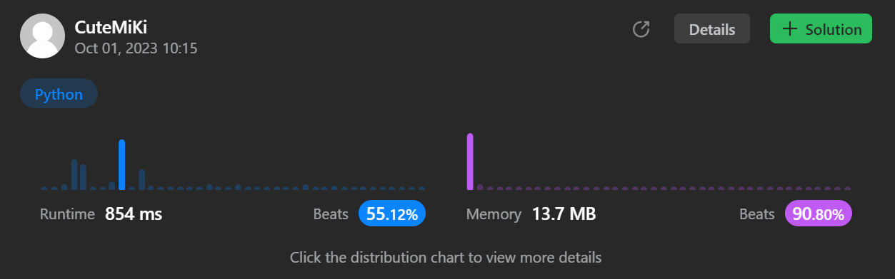

# 416. Partition Equal Subset Sum
### Tag: [Medium](https://github.com/TheOnlyMiki/LeetCode-For-Fun/tree/main#medium-level), [Array](https://github.com/TheOnlyMiki/LeetCode-For-Fun/tree/main#array), [Dynamic Programming](https://github.com/TheOnlyMiki/LeetCode-For-Fun/tree/main#dynamic-programming)
---
<div class="px-5 pt-4"><div class="flex"></div><div class="xFUwe" data-track-load="description_content"><p>Given an integer array <code>nums</code>, return <code>true</code> <em>if you can partition the array into two subsets such that the sum of the elements in both subsets is equal or </em><code>false</code><em> otherwise</em>.</p>

<p>&nbsp;</p>
<p><strong class="example">Example 1:</strong></p>

<pre><strong>Input:</strong> nums = [1,5,11,5]
<strong>Output:</strong> true
<strong>Explanation:</strong> The array can be partitioned as [1, 5, 5] and [11].
</pre>

<p><strong class="example">Example 2:</strong></p>

<pre><strong>Input:</strong> nums = [1,2,3,5]
<strong>Output:</strong> false
<strong>Explanation:</strong> The array cannot be partitioned into equal sum subsets.
</pre>

<p>&nbsp;</p>
<p><strong>Constraints:</strong></p>

<ul>
	<li><code>1 &lt;= nums.length &lt;= 200</code></li>
	<li><code>1 &lt;= nums[i] &lt;= 100</code></li>
</ul>
</div></div>

---


### Solution

```python
class Solution(object):
    def canPartition(self, nums):
        """
        :type nums: List[int]
        :rtype: bool
        """
        # Option 2 - Dynamic Programming
        consum = sum(nums)
        if consum % 2 == 1:
            return False

        n = len(nums)
        consum = consum // 2
        totals = range(consum, -1, -1)

        record = [True] + [False] * consum
        for num in nums:
            for total in totals:
                if total >= num:
                    record[total] = record[total] or record[total-num]

        return record[consum]

        # Option 1 - Wrong, this is for single digit
        """
        maximum = 0
        consum = 0
        for num in nums:
            if num > maximum:
                maximum, num = num, maximum
            consum += num

        return maximum == consum
        """
```
