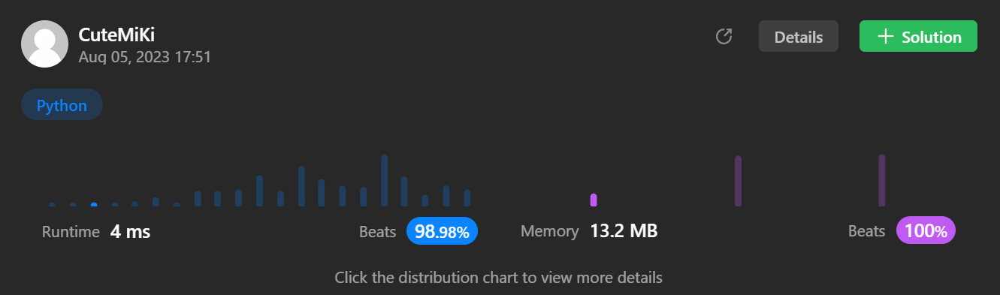

# 433. Minimum Genetic Mutation
### Tag: [Medium](https://github.com/TheOnlyMiki/LeetCode-For-Fun/tree/main#medium-level), [Hash Table](https://github.com/TheOnlyMiki/LeetCode-For-Fun/tree/main#hash-table), [String](https://github.com/TheOnlyMiki/LeetCode-For-Fun/tree/main#string), [Breadth-First Search](https://github.com/TheOnlyMiki/LeetCode-For-Fun/tree/main#breadth-first-search), [Graph](https://github.com/TheOnlyMiki/LeetCode-For-Fun/tree/main#graph)
---
<div class="px-5 pt-4"><div class="flex"></div><div class="xFUwe" data-track-load="description_content"><p>A gene string can be represented by an 8-character long string, with choices from <code>'A'</code>, <code>'C'</code>, <code>'G'</code>, and <code>'T'</code>.</p>

<p>Suppose we need to investigate a mutation from a gene string <code>startGene</code> to a gene string <code>endGene</code> where one mutation is defined as one single character changed in the gene string.</p>

<ul>
	<li>For example, <code>"AACCGGTT" --&gt; "AACCGGTA"</code> is one mutation.</li>
</ul>

<p>There is also a gene bank <code>bank</code> that records all the valid gene mutations. A gene must be in <code>bank</code> to make it a valid gene string.</p>

<p>Given the two gene strings <code>startGene</code> and <code>endGene</code> and the gene bank <code>bank</code>, return <em>the minimum number of mutations needed to mutate from </em><code>startGene</code><em> to </em><code>endGene</code>. If there is no such a mutation, return <code>-1</code>.</p>

<p>Note that the starting point is assumed to be valid, so it might not be included in the bank.</p>

<p>&nbsp;</p>
<p><strong class="example">Example 1:</strong></p>

<pre><strong>Input:</strong> startGene = "AACCGGTT", endGene = "AACCGGTA", bank = ["AACCGGTA"]
<strong>Output:</strong> 1
</pre>

<p><strong class="example">Example 2:</strong></p>

<pre><strong>Input:</strong> startGene = "AACCGGTT", endGene = "AAACGGTA", bank = ["AACCGGTA","AACCGCTA","AAACGGTA"]
<strong>Output:</strong> 2
</pre>

<p>&nbsp;</p>
<p><strong>Constraints:</strong></p>

<ul>
	<li><code>0 &lt;= bank.length &lt;= 10</code></li>
	<li><code>startGene.length == endGene.length == bank[i].length == 8</code></li>
	<li><code>startGene</code>, <code>endGene</code>, and <code>bank[i]</code> consist of only the characters <code>['A', 'C', 'G', 'T']</code>.</li>
</ul>
</div></div>

---


### Solution

```python
class Solution(object):
    def minMutation(self, startGene, endGene, bank):
        """
        :type startGene: str
        :type endGene: str
        :type bank: List[str]
        :rtype: int
        """
        # Option 2 - BFS
        if endGene not in bank or not bank:
            return -1

        gene_map = [startGene]
        record = {startGene}
        transform = 0
        next_gene_map = None

        while gene_map:
            next_gene_map = []
            for gene in gene_map:
                if gene == endGene:
                    return transform

                for temp in bank:
                    if temp not in record and sum(1 for a, b in zip(gene, temp) if a != b) == 1:
                        next_gene_map.append(temp)
                        record.add(temp)
                        
            gene_map = next_gene_map
            transform += 1

        return -1
        
        # Option 1 - traverse the whole maps, too complicated, but they all faster
        """
        if endGene not in bank or not bank:
            return -1

        gene_map = {startGene:set()}
        transform_map = {startGene:0}

        def updateTransform(gene1, gene2):
            for g in gene_map[gene1]:
                transform_map[g] = min(transform_map[g], transform_map[gene1]+1, transform_map[gene2]+2)
            for g in gene_map[gene2]:
                transform_map[g] = min(transform_map[g], transform_map[gene2]+1, transform_map[gene1]+2)

        def connectGene(gene):
            if gene not in gene_map:
                gene_map[gene] = set()
                transform_map[gene] = 11

            for temp in bank:
                if temp not in gene_map:
                    if sum(1 for c1, c2 in zip(gene, temp) if c1 != c2) == 1:
                        transform_map[temp] = transform_map[gene]+1
                        gene_map[gene] = gene_map[temp] = {gene, temp} | gene_map[gene]
                elif temp not in gene_map[gene]:
                    if sum(1 for c1, c2 in zip(gene, temp) if c1 != c2) == 1:
                        transform_map[temp] = min(transform_map[temp], transform_map[gene]+1)
                        transform_map[gene] = min(transform_map[temp]+1, transform_map[gene])
                        updateTransform(gene, temp)
                        gene_map[gene] = gene_map[temp] = gene_map[temp] | gene_map[gene]

        connectGene(startGene)
        for gene in bank:
            connectGene(gene)

        if endGene not in gene_map or startGene not in gene_map[endGene]:
            return -1

        return transform_map[endGene]
        """
```
