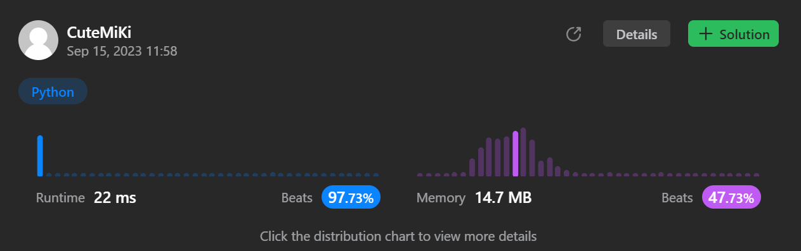

# 437. Path Sum III
### Tag: [Medium](https://github.com/TheOnlyMiki/LeetCode-For-Fun/tree/main#medium-level), [Depth-First Search](https://github.com/TheOnlyMiki/LeetCode-For-Fun/tree/main#depth-first-search), [Binary Tree](https://github.com/TheOnlyMiki/LeetCode-For-Fun/tree/main#binary-tree)
---
<div class="px-5 pt-4"><div class="flex"></div><div class="xFUwe" data-track-load="description_content"><p>Given the <code>root</code> of a binary tree and an integer <code>targetSum</code>, return <em>the number of paths where the sum of the values&nbsp;along the path equals</em>&nbsp;<code>targetSum</code>.</p>

<p>The path does not need to start or end at the root or a leaf, but it must go downwards (i.e., traveling only from parent nodes to child nodes).</p>

<p>&nbsp;</p>
<p><strong class="example">Example 1:</strong></p>

<pre><strong>Input:</strong> root = [10,5,-3,3,2,null,11,3,-2,null,1], targetSum = 8
<strong>Output:</strong> 3
<strong>Explanation:</strong> The paths that sum to 8 are shown.
</pre>

<p><strong class="example">Example 2:</strong></p>

<pre><strong>Input:</strong> root = [5,4,8,11,null,13,4,7,2,null,null,5,1], targetSum = 22
<strong>Output:</strong> 3
</pre>

<p>&nbsp;</p>
<p><strong>Constraints:</strong></p>

<ul>
	<li>The number of nodes in the tree is in the range <code>[0, 1000]</code>.</li>
	<li><code>-10<sup>9</sup> &lt;= Node.val &lt;= 10<sup>9</sup></code></li>
	<li><code>-1000 &lt;= targetSum &lt;= 1000</code></li>
</ul>
</div></div>

---


### Solution

```python
# Definition for a binary tree node.
# class TreeNode(object):
#     def __init__(self, val=0, left=None, right=None):
#         self.val = val
#         self.left = left
#         self.right = right
class Solution(object):
    def pathSum(self, root, targetSum):
        """
        :type root: TreeNode
        :type targetSum: int
        :rtype: int
        """
        record = {0:1}
        self.output = 0

        def dfs(node, total):
            if node:
                total += node.val

                if total - targetSum in record:
                    self.output += record[total - targetSum]

                if total in record:
                    record[total] += 1
                else:
                    record[total] = 1

                dfs(node.left, total)
                dfs(node.right, total)

                record[total] -= 1

        dfs(root, 0)
        return self.output
```
