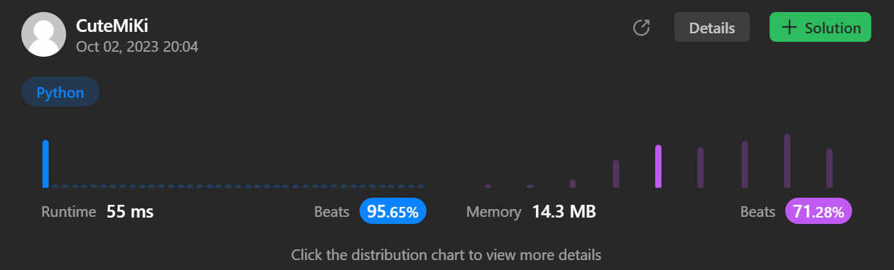

# 438. Find All Anagrams in a String
### Tag: [Medium](https://github.com/TheOnlyMiki/LeetCode-For-Fun/tree/main#medium-level), [Hash Table](https://github.com/TheOnlyMiki/LeetCode-For-Fun/tree/main#hash-table), [String](https://github.com/TheOnlyMiki/LeetCode-For-Fun/tree/main#string), [Sliding Window](https://github.com/TheOnlyMiki/LeetCode-For-Fun/tree/main#sliding-window)
---
<div class="px-5 pt-4"><div class="flex"></div><div class="xFUwe" data-track-load="description_content"><p>Given two strings <code>s</code> and <code>p</code>, return <em>an array of all the start indices of </em><code>p</code><em>'s anagrams in </em><code>s</code>. You may return the answer in <strong>any order</strong>.</p>

<p>An <strong>Anagram</strong> is a word or phrase formed by rearranging the letters of a different word or phrase, typically using all the original letters exactly once.</p>

<p>&nbsp;</p>
<p><strong class="example">Example 1:</strong></p>

<pre><strong>Input:</strong> s = "cbaebabacd", p = "abc"
<strong>Output:</strong> [0,6]
<strong>Explanation:</strong>
The substring with start index = 0 is "cba", which is an anagram of "abc".
The substring with start index = 6 is "bac", which is an anagram of "abc".
</pre>

<p><strong class="example">Example 2:</strong></p>

<pre><strong>Input:</strong> s = "abab", p = "ab"
<strong>Output:</strong> [0,1,2]
<strong>Explanation:</strong>
The substring with start index = 0 is "ab", which is an anagram of "ab".
The substring with start index = 1 is "ba", which is an anagram of "ab".
The substring with start index = 2 is "ab", which is an anagram of "ab".
</pre>

<p>&nbsp;</p>
<p><strong>Constraints:</strong></p>

<ul>
	<li><code>1 &lt;= s.length, p.length &lt;= 3 * 10<sup>4</sup></code></li>
	<li><code>s</code> and <code>p</code> consist of lowercase English letters.</li>
</ul>
</div></div>

---


### Solution

```python
class Solution(object):
    def findAnagrams(self, s, p):
        """
        :type s: str
        :type p: str
        :rtype: List[int]
        """
        size = len(p)
        if size > len(s):
            return []

        def checkAllZero():
            for num in count.values():
                if num != 0:
                    return False

            return True

        total = 0
        count = {}
        for c in p:
            total += 1
            if c in count:
                count[c] += 1
            else:
                count[c] = 1

        for c in s[:size-1]:
            if c in count:
                total -= 1
                count[c] -= 1

        output = []
        for i in range(size-1, len(s)):
            if s[i] in count:
                total -= 1
                count[s[i]] -= 1

            if total == 0:
                if checkAllZero():
                    output.append(i - size + 1)

            if s[i - size + 1] in count:
                total += 1
                count[s[i - size + 1]] += 1

        return output
```
