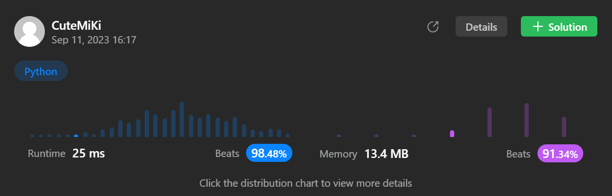

# 443. String Compression
### Tag: [Medium](https://github.com/TheOnlyMiki/LeetCode-For-Fun/tree/main#medium-level), [Two Pointers](https://github.com/TheOnlyMiki/LeetCode-For-Fun/tree/main#two-pointers), [String](https://github.com/TheOnlyMiki/LeetCode-For-Fun/tree/main#string)
---
<div class="px-5 pt-4"><div class="flex"></div><div class="xFUwe" data-track-load="description_content"><p>Given an array of characters <code>chars</code>, compress it using the following algorithm:</p>

<p>Begin with an empty string <code>s</code>. For each group of <strong>consecutive repeating characters</strong> in <code>chars</code>:</p>

<ul>
	<li>If the group's length is <code>1</code>, append the character to <code>s</code>.</li>
	<li>Otherwise, append the character followed by the group's length.</li>
</ul>

<p>The compressed string <code>s</code> <strong>should not be returned separately</strong>, but instead, be stored <strong>in the input character array <code>chars</code></strong>. Note that group lengths that are <code>10</code> or longer will be split into multiple characters in <code>chars</code>.</p>

<p>After you are done <strong>modifying the input array,</strong> return <em>the new length of the array</em>.</p>

<p>You must write an algorithm that uses only constant extra space.</p>

<p>&nbsp;</p>
<p><strong class="example">Example 1:</strong></p>

<pre><strong>Input:</strong> chars = ["a","a","b","b","c","c","c"]
<strong>Output:</strong> Return 6, and the first 6 characters of the input array should be: ["a","2","b","2","c","3"]
<strong>Explanation:</strong> The groups are "aa", "bb", and "ccc". This compresses to "a2b2c3".
</pre>

<p><strong class="example">Example 2:</strong></p>

<pre><strong>Input:</strong> chars = ["a"]
<strong>Output:</strong> Return 1, and the first character of the input array should be: ["a"]
<strong>Explanation:</strong> The only group is "a", which remains uncompressed since it's a single character.
</pre>

<p><strong class="example">Example 3:</strong></p>

<pre><strong>Input:</strong> chars = ["a","b","b","b","b","b","b","b","b","b","b","b","b"]
<strong>Output:</strong> Return 4, and the first 4 characters of the input array should be: ["a","b","1","2"].
<strong>Explanation:</strong> The groups are "a" and "bbbbbbbbbbbb". This compresses to "ab12".</pre>

<p>&nbsp;</p>
<p><strong>Constraints:</strong></p>

<ul>
	<li><code>1 &lt;= chars.length &lt;= 2000</code></li>
	<li><code>chars[i]</code> is a lowercase English letter, uppercase English letter, digit, or symbol.</li>
</ul>
</div></div>

---


### Solution

```python
class Solution(object):
    def compress(self, chars):
        """
        :type chars: List[str]
        :rtype: int
        """
        # Option 2
        length = len(chars)
        i, insert = 0, 0
        count = c = None
        
        while i < length:
            c = chars[i]
            count = 1
            i += 1
            while i < length and chars[i] == c:
                count += 1
                i += 1

            chars[insert] = c
            insert += 1

            if count != 1:
                for n in str(count):
                    chars[insert] = n
                    insert += 1

        return insert

        # Option 1
        """
        def updateCount(chars, i, count):
            for n in str(count):
                chars[i] = n
                i += 1

            return i

        count = 1
        previou = None
        insert = 0
        for i in range(len(chars)):
            if chars[i] == previou:
                count += 1
            else:
                if count != 1:
                    insert = updateCount(chars, insert, count)
                chars[insert] = chars[i]
                previou = chars[i]
                count = 1
                insert += 1

        if count != 1:
            return updateCount(chars, insert, count)

        return insert
        """
```
