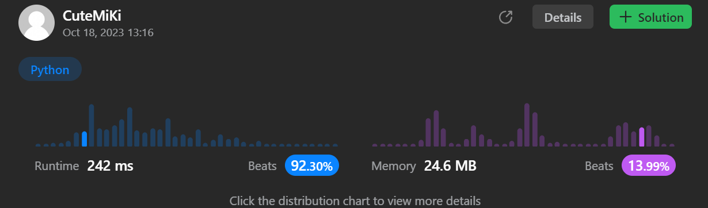

# 448. Find All Numbers Disappeared in an Array
### Tag: [Easy](https://github.com/TheOnlyMiki/LeetCode-For-Fun/tree/main#easy-level), [Array](https://github.com/TheOnlyMiki/LeetCode-For-Fun/tree/main#array), [Hash Table](https://github.com/TheOnlyMiki/LeetCode-For-Fun/tree/main#hash-table)
---
<div class="px-5 pt-4"><div class="flex"></div><div class="xFUwe" data-track-load="description_content"><p>Given an array <code>nums</code> of <code>n</code> integers where <code>nums[i]</code> is in the range <code>[1, n]</code>, return <em>an array of all the integers in the range</em> <code>[1, n]</code> <em>that do not appear in</em> <code>nums</code>.</p>

<p>&nbsp;</p>
<p><strong class="example">Example 1:</strong></p>
<pre><strong>Input:</strong> nums = [4,3,2,7,8,2,3,1]
<strong>Output:</strong> [5,6]
</pre><p><strong class="example">Example 2:</strong></p>
<pre><strong>Input:</strong> nums = [1,1]
<strong>Output:</strong> [2]
</pre>
<p>&nbsp;</p>
<p><strong>Constraints:</strong></p>

<ul>
	<li><code>n == nums.length</code></li>
	<li><code>1 &lt;= n &lt;= 10<sup>5</sup></code></li>
	<li><code>1 &lt;= nums[i] &lt;= n</code></li>
</ul>

<p>&nbsp;</p>
<p><strong>Follow up:</strong> Could you do it without extra space and in <code>O(n)</code> runtime? You may assume the returned list does not count as extra space.</p>
</div></div>

---


### Solution

```python
class Solution(object):
    def findDisappearedNumbers(self, nums):
        """
        :type nums: List[int]
        :rtype: List[int]
        """
        # Option 2 - In palce, Time O(n), Space O(1)
        for num in nums:
            if nums[abs(num)-1] > 0:
                nums[abs(num)-1] *= -1

        return [i for i, num in enumerate(nums, start=1) if num > 0]

        # Option 1 - Hash Table, Time O(n), Space O(n)
        """
        return set(range(1, len(nums)+1)) - set(nums)
        """
```
