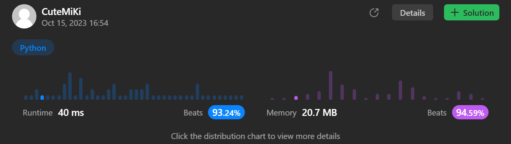

# 449. Serialize and Deserialize BST
### Tag: [Medium](https://github.com/TheOnlyMiki/LeetCode-For-Fun/tree/main#medium-level), [String](https://github.com/TheOnlyMiki/LeetCode-For-Fun/tree/main#string), [Depth-First Search](https://github.com/TheOnlyMiki/LeetCode-For-Fun/tree/main#depth-first-search), [Breadth-First Search](https://github.com/TheOnlyMiki/LeetCode-For-Fun/tree/main#breadth-first-search), [Design](https://github.com/TheOnlyMiki/LeetCode-For-Fun/tree/main#design), [Binary Search](https://github.com/TheOnlyMiki/LeetCode-For-Fun/tree/main#binary-search), [Binary Tree](https://github.com/TheOnlyMiki/LeetCode-For-Fun/tree/main#binary-tree)
---
<div class="px-5 pt-4"><div class="flex"></div><div class="xFUwe" data-track-load="description_content"><p>Serialization is converting a data structure or object into a sequence of bits so that it can be stored in a file or memory buffer, or transmitted across a network connection link to be reconstructed later in the same or another computer environment.</p>

<p>Design an algorithm to serialize and deserialize a <b>binary search tree</b>. There is no restriction on how your serialization/deserialization algorithm should work. You need to ensure that a binary search tree can be serialized to a string, and this string can be deserialized to the original tree structure.</p>

<p><b>The encoded string should be as compact as possible.</b></p>

<p>&nbsp;</p>
<p><strong class="example">Example 1:</strong></p>
<pre><strong>Input:</strong> root = [2,1,3]
<strong>Output:</strong> [2,1,3]
</pre><p><strong class="example">Example 2:</strong></p>
<pre><strong>Input:</strong> root = []
<strong>Output:</strong> []
</pre>
<p>&nbsp;</p>
<p><strong>Constraints:</strong></p>

<ul>
	<li>The number of nodes in the tree is in the range <code>[0, 10<sup>4</sup>]</code>.</li>
	<li><code>0 &lt;= Node.val &lt;= 10<sup>4</sup></code></li>
	<li>The input tree is <strong>guaranteed</strong> to be a binary search tree.</li>
</ul>
</div></div>

---


### Solution

```python
# Definition for a binary tree node.
# class TreeNode(object):
#     def __init__(self, x):
#         self.val = x
#         self.left = None
#         self.right = None

class Codec:

    # Option 3 - DFS method, with extra characters
    def serialize(self, root):
        if not root:
            return ""

        def readTree(nodes, node):
            if node:
                nodes.append(str(node.val))
                readTree(nodes, node.left)
                readTree(nodes, node.right)
            else:
                nodes.append('.')

        store = []
        readTree(store, root)
        return ' '.join(reversed(store))

    def deserialize(self, data):
        def buildTree(nodes):
            if nodes:
                num = nodes.pop()
                if num == '.':
                    return None

                node = TreeNode(int(num))
                node.left = buildTree(nodes)
                node.right = buildTree(nodes)
                return node

            return None
        
        return buildTree(data.split())

    # Option 2 - BFS method, with extra characters
    """
    def serialize(self, root):
        if not root:
            return ""

        nodes = [root]
        output = []
        while nodes:
            next_level = []

            for node in nodes:
                if node:
                    next_level += [node.left, node.right]
                    output.append(str(node.val))
                else:
                    output.append('.')

            nodes = next_level
        
        return ' '.join(reversed(output))

    def deserialize(self, data):
        if not data:
            return None

        data = data.split()
        head = TreeNode(int(data.pop()))
        nodes = [head]

        while nodes:
            next_level = []

            for node in nodes:
                left = data.pop()
                if left != '.':
                    node.left = TreeNode(int(left))
                    next_level.append(node.left)

                right = data.pop()
                if right != '.':
                    node.right = TreeNode(int(right))
                    next_level.append(node.right)
                
            nodes = next_level
        
        return head
        """

    # Option 1 - DFS method, used BST feature to build the tree
    """
    def serialize(self, root):
        if not root:
            return ""
            
        def readTree(store, node):
            if node:
                store.append(str(node.val))
                readTree(store, node.left)
                readTree(store, node.right)

            return

        record = []
        readTree(record, root)
        return '.'.join(reversed(record))

    def deserialize(self, data):
        def buildTree(record, maximum, minimum):
            if record:
                if record[-1] < minimum or record[-1] > maximum:
                    return None

                node = TreeNode(record.pop())
                node.left = buildTree(record, node.val, minimum)
                node.right = buildTree(record, maximum, node.val)
                return node

            return None
        
        store = []
        s = ""
        for c in data:
            if c == '.':
                store.append(int(s))
                s = ""
            else:
                s += c

        if s: 
            store.append(int(s))

        return buildTree(store, 1e5, -1)
        """


# Your Codec object will be instantiated and called as such:
# ser = Codec()
# deser = Codec()
# tree = ser.serialize(root)
# ans = deser.deserialize(tree)
# return ans
```
