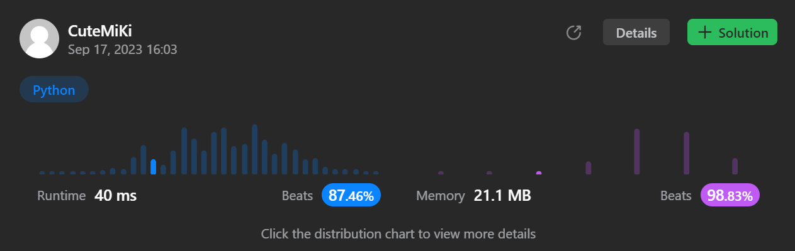

# 450. Delete Node in a BST
### Tag: [Medium](https://github.com/TheOnlyMiki/LeetCode-For-Fun/tree/main#medium-level), [Binary Search](https://github.com/TheOnlyMiki/LeetCode-For-Fun/tree/main#binary-search), [Binary Tree](https://github.com/TheOnlyMiki/LeetCode-For-Fun/tree/main#binary-tree)
---
<div class="px-5 pt-4"><div class="flex"></div><div class="xFUwe" data-track-load="description_content"><p>Given a root node reference of a BST and a key, delete the node with the given key in the BST. Return <em>the <strong>root node reference</strong> (possibly updated) of the BST</em>.</p>

<p>Basically, the deletion can be divided into two stages:</p>

<ol>
	<li>Search for a node to remove.</li>
	<li>If the node is found, delete the node.</li>
</ol>

<p>&nbsp;</p>
<p><strong class="example">Example 1:</strong></p>

<pre><strong>Input:</strong> root = [5,3,6,2,4,null,7], key = 3
<strong>Output:</strong> [5,4,6,2,null,null,7]
<strong>Explanation:</strong> Given key to delete is 3. So we find the node with value 3 and delete it.
One valid answer is [5,4,6,2,null,null,7], shown in the above BST.
Please notice that another valid answer is [5,2,6,null,4,null,7] and it's also accepted.

</pre>

<p><strong class="example">Example 2:</strong></p>

<pre><strong>Input:</strong> root = [5,3,6,2,4,null,7], key = 0
<strong>Output:</strong> [5,3,6,2,4,null,7]
<strong>Explanation:</strong> The tree does not contain a node with value = 0.
</pre>

<p><strong class="example">Example 3:</strong></p>

<pre><strong>Input:</strong> root = [], key = 0
<strong>Output:</strong> []
</pre>

<p>&nbsp;</p>
<p><strong>Constraints:</strong></p>

<ul>
	<li>The number of nodes in the tree is in the range <code>[0, 10<sup>4</sup>]</code>.</li>
	<li><code>-10<sup>5</sup> &lt;= Node.val &lt;= 10<sup>5</sup></code></li>
	<li>Each node has a <strong>unique</strong> value.</li>
	<li><code>root</code> is a valid binary search tree.</li>
	<li><code>-10<sup>5</sup> &lt;= key &lt;= 10<sup>5</sup></code></li>
</ul>

<p>&nbsp;</p>
<p><strong>Follow up:</strong> Could you solve it with time complexity <code>O(height of tree)</code>?</p>
</div></div>

---


### Solution

```python
# Definition for a binary tree node.
# class TreeNode(object):
#     def __init__(self, val=0, left=None, right=None):
#         self.val = val
#         self.left = left
#         self.right = right
class Solution(object):
    def deleteNode(self, root, key):
        """
        :type root: TreeNode
        :type key: int
        :rtype: TreeNode
        """
        start = TreeNode(None, root)
        previou, node = start, root
        while node:
            if node.val == key:
                break
            
            previou, node = node, node.left if node.val > key else node.right

        if node:
            fromLeft = (previou.left and previou.left.val == node.val)
            current = None
            if node.left:
                parent, current = node, node.left
                while current.right:
                    parent, current = current, current.right

                current.right, parent.right = node.right, None
                if node.left.val == current.val:
                    node.left = None

                parent = current
                while parent.left:
                    parent = parent.left

                parent.left = node.left
                
            elif node.right:
                parent, current = node, node.right
                while current.left:
                    parent, current = current, current.left

                current.left, parent.left = node.left, None
                if node.right.val == current.val:
                    node.right = None

                parent = current
                while parent.right:
                    parent = parent.right

                parent.right = node.right

            if fromLeft:
                previou.left = current
            else:
                previou.right = current

        return start.left
```
