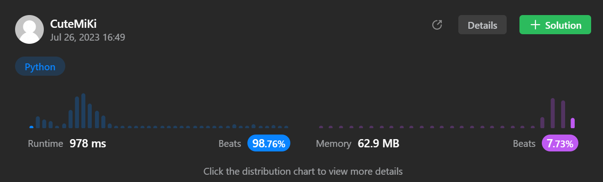

# 452. Minimum Number of Arrows to Burst Balloons
### Tag: [Medium](https://github.com/TheOnlyMiki/LeetCode-For-Fun/tree/main#medium-level), [Array](https://github.com/TheOnlyMiki/LeetCode-For-Fun/tree/main#array), [Greedy](https://github.com/TheOnlyMiki/LeetCode-For-Fun/tree/main#greedy), [Sorting](https://github.com/TheOnlyMiki/LeetCode-For-Fun/tree/main#sorting)
---
<div class="px-5 pt-4"><div class="flex"></div><div class="_1l1MA" data-track-load="description_content"><p>There are some spherical balloons taped onto a flat wall that represents the XY-plane. The balloons are represented as a 2D integer array <code>points</code> where <code>points[i] = [x<sub>start</sub>, x<sub>end</sub>]</code> denotes a balloon whose <strong>horizontal diameter</strong> stretches between <code>x<sub>start</sub></code> and <code>x<sub>end</sub></code>. You do not know the exact y-coordinates of the balloons.</p>

<p>Arrows can be shot up <strong>directly vertically</strong> (in the positive y-direction) from different points along the x-axis. A balloon with <code>x<sub>start</sub></code> and <code>x<sub>end</sub></code> is <strong>burst</strong> by an arrow shot at <code>x</code> if <code>x<sub>start</sub> &lt;= x &lt;= x<sub>end</sub></code>. There is <strong>no limit</strong> to the number of arrows that can be shot. A shot arrow keeps traveling up infinitely, bursting any balloons in its path.</p>

<p>Given the array <code>points</code>, return <em>the <strong>minimum</strong> number of arrows that must be shot to burst all balloons</em>.</p>

<p>&nbsp;</p>
<p><strong class="example">Example 1:</strong></p>

<pre><strong>Input:</strong> points = [[10,16],[2,8],[1,6],[7,12]]
<strong>Output:</strong> 2
<strong>Explanation:</strong> The balloons can be burst by 2 arrows:
- Shoot an arrow at x = 6, bursting the balloons [2,8] and [1,6].
- Shoot an arrow at x = 11, bursting the balloons [10,16] and [7,12].
</pre>

<p><strong class="example">Example 2:</strong></p>

<pre><strong>Input:</strong> points = [[1,2],[3,4],[5,6],[7,8]]
<strong>Output:</strong> 4
<strong>Explanation:</strong> One arrow needs to be shot for each balloon for a total of 4 arrows.
</pre>

<p><strong class="example">Example 3:</strong></p>

<pre><strong>Input:</strong> points = [[1,2],[2,3],[3,4],[4,5]]
<strong>Output:</strong> 2
<strong>Explanation:</strong> The balloons can be burst by 2 arrows:
- Shoot an arrow at x = 2, bursting the balloons [1,2] and [2,3].
- Shoot an arrow at x = 4, bursting the balloons [3,4] and [4,5].
</pre>

<p>&nbsp;</p>
<p><strong>Constraints:</strong></p>

<ul>
	<li><code>1 &lt;= points.length &lt;= 10<sup>5</sup></code></li>
	<li><code>points[i].length == 2</code></li>
	<li><code>-2<sup>31</sup> &lt;= x<sub>start</sub> &lt; x<sub>end</sub> &lt;= 2<sup>31</sup> - 1</code></li>
</ul>
</div></div>

---


### Solution

```python
class Solution(object):
    def findMinArrowShots(self, points):
        """
        :type points: List[List[int]]
        :rtype: int
        """
        # Option 2
        
        points = sorted(points, key =lambda x:x[1])
        record_j = points[0][1]
        output = 1

        for i in range(1, len(points)):
            if points[i][0] > record_j:
                output += 1
                record_j = points[i][1]

        return output
        

        # Option 1
        
        points = sorted(points, key =lambda x:x[0])

        i = 0
        length = len(points)
        record_j = None
        output = 0

        while i < length:
            record_j = points[i][1]

            while i+1 < length and points[i+1][0] <= record_j:
                i += 1
                if record_j > points[i][1]:
                    record_j = points[i][1]

            output += 1
            i += 1
        
        return output
```
