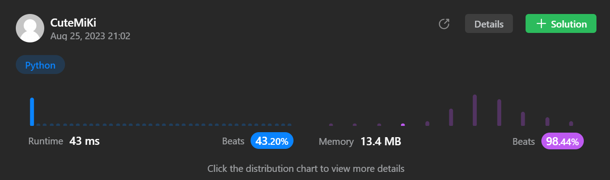

# 459. Repeated Substring Pattern
### Tag: [Easy](https://github.com/TheOnlyMiki/LeetCode-For-Fun/tree/main#easy-level), [String](https://github.com/TheOnlyMiki/LeetCode-For-Fun/tree/main#string)
---
<div class="px-5 pt-4"><div class="flex"></div><div class="xFUwe" data-track-load="description_content"><p>Given a string <code>s</code>, check if it can be constructed by taking a substring of it and appending multiple copies of the substring together.</p>

<p>&nbsp;</p>
<p><strong class="example">Example 1:</strong></p>

<pre><strong>Input:</strong> s = "abab"
<strong>Output:</strong> true
<strong>Explanation:</strong> It is the substring "ab" twice.
</pre>

<p><strong class="example">Example 2:</strong></p>

<pre><strong>Input:</strong> s = "aba"
<strong>Output:</strong> false
</pre>

<p><strong class="example">Example 3:</strong></p>

<pre><strong>Input:</strong> s = "abcabcabcabc"
<strong>Output:</strong> true
<strong>Explanation:</strong> It is the substring "abc" four times or the substring "abcabc" twice.
</pre>

<p>&nbsp;</p>
<p><strong>Constraints:</strong></p>

<ul>
	<li><code>1 &lt;= s.length &lt;= 10<sup>4</sup></code></li>
	<li><code>s</code> consists of lowercase English letters.</li>
</ul>
</div></div>

---


### Solution

```python
class Solution(object):
    def repeatedSubstringPattern(self, s):
        """
        :type s: str
        :rtype: bool
        """
        length = len(s)
        devide = 2
        domain, remain = divmod(length, devide)
        i = temp = None

        while domain != 0:
            if remain == 0:
                temp = s[:domain]
                i = domain

                while i < length:
                    if temp != s[ i : i+domain ]:
                        break
                    i += domain

                if i == length:
                    return True

            devide += 1
            domain, remain = divmod(length, devide)

        return False
```
