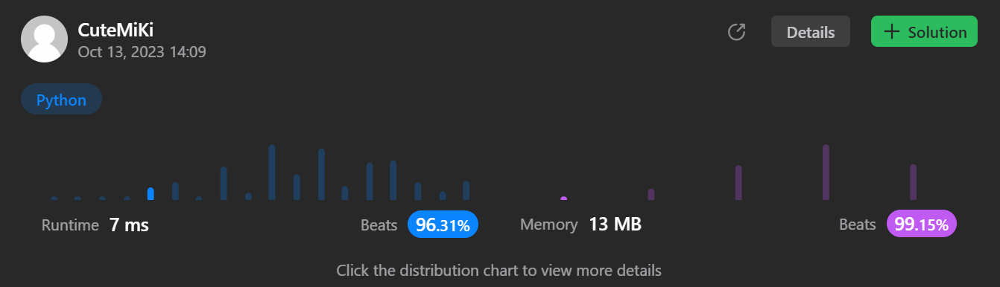

# 461. Hamming Distance
### Tag: [Easy](https://github.com/TheOnlyMiki/LeetCode-For-Fun/tree/main#easy-level), [Bit Manipulation](https://github.com/TheOnlyMiki/LeetCode-For-Fun/tree/main#bit-manipulation)
---
<div class="px-5 pt-4"><div class="flex"></div><div class="xFUwe" data-track-load="description_content"><p>The <a href="https://en.wikipedia.org/wiki/Hamming_distance" target="_blank">Hamming distance</a> between two integers is the number of positions at which the corresponding bits are different.</p>

<p>Given two integers <code>x</code> and <code>y</code>, return <em>the <strong>Hamming distance</strong> between them</em>.</p>

<p>&nbsp;</p>
<p><strong class="example">Example 1:</strong></p>

<pre><strong>Input:</strong> x = 1, y = 4
<strong>Output:</strong> 2
<strong>Explanation:</strong>
1   (0 0 0 1)
4   (0 1 0 0)
       ↑   ↑
The above arrows point to positions where the corresponding bits are different.
</pre>

<p><strong class="example">Example 2:</strong></p>

<pre><strong>Input:</strong> x = 3, y = 1
<strong>Output:</strong> 1
</pre>

<p>&nbsp;</p>
<p><strong>Constraints:</strong></p>

<ul>
	<li><code>0 &lt;=&nbsp;x, y &lt;= 2<sup>31</sup> - 1</code></li>
</ul>
</div></div>

---


### Solution

```python
class Solution(object):
    def hammingDistance(self, x, y):
        """
        :type x: int
        :type y: int
        :rtype: int
        """
        # Option 2 - XOR
        xor, count = x^y, 0
        while xor != 0:
            if xor & 1 == 1:
                count += 1
            xor >>= 1
            
        return count

        # Option 1 - Count of different bits
        """
        count = 0
        while x != y:
            if x & 1 != y & 1:
                count += 1

            x, y = x >> 1, y >> 1
        
        return count
        """
```
