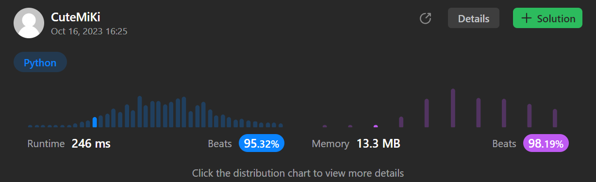

# 485. Max Consecutive Ones
### Tag: [Easy](https://github.com/TheOnlyMiki/LeetCode-For-Fun/tree/main#easy-level), [Array](https://github.com/TheOnlyMiki/LeetCode-For-Fun/tree/main#array)
---
<div class="px-5 pt-4"><div class="flex"></div><div class="xFUwe" data-track-load="description_content"><p>Given a binary array <code>nums</code>, return <em>the maximum number of consecutive </em><code>1</code><em>'s in the array</em>.</p>

<p>&nbsp;</p>
<p><strong class="example">Example 1:</strong></p>

<pre><strong>Input:</strong> nums = [1,1,0,1,1,1]
<strong>Output:</strong> 3
<strong>Explanation:</strong> The first two digits or the last three digits are consecutive 1s. The maximum number of consecutive 1s is 3.
</pre>

<p><strong class="example">Example 2:</strong></p>

<pre><strong>Input:</strong> nums = [1,0,1,1,0,1]
<strong>Output:</strong> 2
</pre>

<p>&nbsp;</p>
<p><strong>Constraints:</strong></p>

<ul>
	<li><code>1 &lt;= nums.length &lt;= 10<sup>5</sup></code></li>
	<li><code>nums[i]</code> is either <code>0</code> or <code>1</code>.</li>
</ul>
</div></div>

---


### Solution

```python
class Solution(object):
    def findMaxConsecutiveOnes(self, nums):
        """
        :type nums: List[int]
        :rtype: int
        """
        output, count = 0, 0
        for num in nums:
            if num == 0:
                count = 0
            else:
                count += 1
                if count > output:
                    output = count

        return output
```
