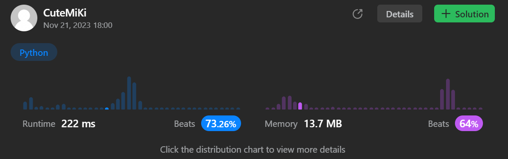

# 494. Target Sum
### Tag: [Medium](https://github.com/TheOnlyMiki/LeetCode-For-Fun/tree/main#medium-level), [Array](https://github.com/TheOnlyMiki/LeetCode-For-Fun/tree/main#array), [Dynamic Programming](https://github.com/TheOnlyMiki/LeetCode-For-Fun/tree/main#dynamic-programming), [Backtracking](https://github.com/TheOnlyMiki/LeetCode-For-Fun/tree/main#backtracking), [Depth-First Search](https://github.com/TheOnlyMiki/LeetCode-For-Fun/tree/main#depth-first-search)
---
<div class="px-5 pt-4"><div class="flex"></div><div class="xFUwe" data-track-load="description_content"><p>You are given an integer array <code>nums</code> and an integer <code>target</code>.</p>

<p>You want to build an <strong>expression</strong> out of nums by adding one of the symbols <code>'+'</code> and <code>'-'</code> before each integer in nums and then concatenate all the integers.</p>

<ul>
	<li>For example, if <code>nums = [2, 1]</code>, you can add a <code>'+'</code> before <code>2</code> and a <code>'-'</code> before <code>1</code> and concatenate them to build the expression <code>"+2-1"</code>.</li>
</ul>

<p>Return the number of different <strong>expressions</strong> that you can build, which evaluates to <code>target</code>.</p>

<p>&nbsp;</p>
<p><strong class="example">Example 1:</strong></p>

<pre><strong>Input:</strong> nums = [1,1,1,1,1], target = 3
<strong>Output:</strong> 5
<strong>Explanation:</strong> There are 5 ways to assign symbols to make the sum of nums be target 3.
-1 + 1 + 1 + 1 + 1 = 3
+1 - 1 + 1 + 1 + 1 = 3
+1 + 1 - 1 + 1 + 1 = 3
+1 + 1 + 1 - 1 + 1 = 3
+1 + 1 + 1 + 1 - 1 = 3
</pre>

<p><strong class="example">Example 2:</strong></p>

<pre><strong>Input:</strong> nums = [1], target = 1
<strong>Output:</strong> 1
</pre>

<p>&nbsp;</p>
<p><strong>Constraints:</strong></p>

<ul>
	<li><code>1 &lt;= nums.length &lt;= 20</code></li>
	<li><code>0 &lt;= nums[i] &lt;= 1000</code></li>
	<li><code>0 &lt;= sum(nums[i]) &lt;= 1000</code></li>
	<li><code>-1000 &lt;= target &lt;= 1000</code></li>
</ul>
</div></div>

---


### Solution

```python
class Solution(object):
    def findTargetSumWays(self, nums, target):
        """
        :type nums: List[int]
        :type target: int
        :rtype: int
        """
        # Option 2 - BF method with memorize
        record = {}
        
        def dfs(record, i, consum):
            if (i, consum) in record:
                return record[(i, consum)]

            if i == -1:
                return 1 if consum == target else 0

            record[(i, consum)] = dfs(record, i-1, consum + nums[i]) + dfs(record, i-1, consum - nums[i])
            return record[(i, consum)]      

        return dfs(record, len(nums)-1, 0)

        # Option 1 - BF method, cannot pass
        """
        self.output = 0
        
        def dfs(consum, i):
            if i == -1:
                if consum == target:
                    self.output += 1
                return

            dfs(consum + nums[i], i-1)
            dfs(consum - nums[i], i-1)

        dfs(0,len(nums)-1)
        return self.output
        """
```
