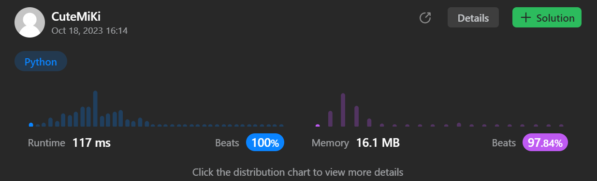

# 498. Diagonal Traverse
### Tag: [Medium](https://github.com/TheOnlyMiki/LeetCode-For-Fun/tree/main#medium-level), [Array](https://github.com/TheOnlyMiki/LeetCode-For-Fun/tree/main#array), [Matrix](https://github.com/TheOnlyMiki/LeetCode-For-Fun/tree/main#matrix)
---
<div class="px-5 pt-4"><div class="flex"></div><div class="xFUwe" data-track-load="description_content"><p>Given an <code>m x n</code> matrix <code>mat</code>, return <em>an array of all the elements of the array in a diagonal order</em>.</p>

<p>&nbsp;</p>
<p><strong class="example">Example 1:</strong></p>

<pre><strong>Input:</strong> mat = [[1,2,3],[4,5,6],[7,8,9]]
<strong>Output:</strong> [1,2,4,7,5,3,6,8,9]
</pre>

<p><strong class="example">Example 2:</strong></p>

<pre><strong>Input:</strong> mat = [[1,2],[3,4]]
<strong>Output:</strong> [1,2,3,4]
</pre>

<p>&nbsp;</p>
<p><strong>Constraints:</strong></p>

<ul>
	<li><code>m == mat.length</code></li>
	<li><code>n == mat[i].length</code></li>
	<li><code>1 &lt;= m, n &lt;= 10<sup>4</sup></code></li>
	<li><code>1 &lt;= m * n &lt;= 10<sup>4</sup></code></li>
	<li><code>-10<sup>5</sup> &lt;= mat[i][j] &lt;= 10<sup>5</sup></code></li>
</ul>
</div></div>

---


### Solution

```python
class Solution(object):
    def findDiagonalOrder(self, mat):
        """
        :type mat: List[List[int]]
        :rtype: List[int]
        """
        # Option 2
        row, col = len(mat), len(mat[0])
        last_row, last_col = row-1, col-1
        bottom2top, i, j = True, 0, 0
        output = [0] * (row*col)
        
        for n in range(row*col):
            output[n] = mat[i][j]

            if bottom2top:
                if i == 0 or j == last_col:
                    bottom2top = False
                    if j == last_col:
                        i += 1
                    else:
                        j += 1
                else:
                    i, j = i-1, j+1
            else:
                if i == last_row or j == 0:
                    bottom2top = True
                    if i == last_row:
                        j += 1
                    else:
                        i += 1
                else:
                    i, j = i+1, j-1

        return output

        # Option 1
        """
        row, col = len(mat), len(mat[0])

        def readFromLeft(i, j):
            while j != col:
                output.append(mat[i][j])
                if i == 0:
                    return
                i, j = i-1, j+1

        def readFromRight(i, j):
            while j != row:
                output.append(mat[j][i])
                if i == 0:
                    return
                i, j = i-1, j+1

        output = []
        for i in range(row+col):
            if i & 1 == 0:
                if i < row:
                    readFromLeft(i, 0)
                else:
                    readFromLeft(row-1, i-row+1)
            else:
                if i < col:
                    readFromRight(i, 0)
                else:
                    readFromRight(col-1, i-col+1)

        return output
        """
```
