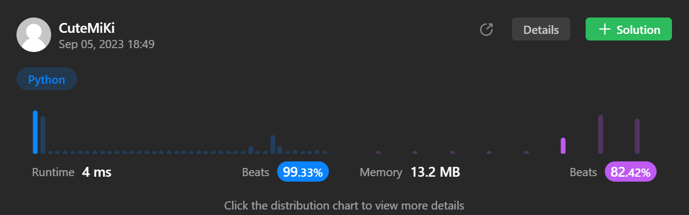

# 509. Fibonacci Number
### Tag: [Easy](https://github.com/TheOnlyMiki/LeetCode-For-Fun/tree/main#easy-level), [Math](https://github.com/TheOnlyMiki/LeetCode-For-Fun/tree/main#math), [Dynamic Programming](https://github.com/TheOnlyMiki/LeetCode-For-Fun/tree/main#dynamic-programming)
---
<div class="px-5 pt-4"><div class="flex"></div><div class="xFUwe" data-track-load="description_content"><p>The <b>Fibonacci numbers</b>, commonly denoted <code>F(n)</code> form a sequence, called the <b>Fibonacci sequence</b>, such that each number is the sum of the two preceding ones, starting from <code>0</code> and <code>1</code>. That is,</p>

<pre>F(0) = 0, F(1) = 1
F(n) = F(n - 1) + F(n - 2), for n &gt; 1.
</pre>

<p>Given <code>n</code>, calculate <code>F(n)</code>.</p>

<p>&nbsp;</p>
<p><strong class="example">Example 1:</strong></p>

<pre><strong>Input:</strong> n = 2
<strong>Output:</strong> 1
<strong>Explanation:</strong> F(2) = F(1) + F(0) = 1 + 0 = 1.
</pre>

<p><strong class="example">Example 2:</strong></p>

<pre><strong>Input:</strong> n = 3
<strong>Output:</strong> 2
<strong>Explanation:</strong> F(3) = F(2) + F(1) = 1 + 1 = 2.
</pre>

<p><strong class="example">Example 3:</strong></p>

<pre><strong>Input:</strong> n = 4
<strong>Output:</strong> 3
<strong>Explanation:</strong> F(4) = F(3) + F(2) = 2 + 1 = 3.
</pre>

<p>&nbsp;</p>
<p><strong>Constraints:</strong></p>

<ul>
	<li><code>0 &lt;= n &lt;= 30</code></li>
</ul>
</div></div>

---


### Solution

```python
class Solution(object):
    def fib(self, n):
        """
        :type n: int
        :rtype: int
        """
        # Option 2
        previou_2, previou_1 = 0, 1
        for i in range(1, n):
            previou_2, previou_1 = previou_1, previou_2+previou_1

        return previou_1 if n > 1 else n

        # Option 1
        """
        record = {0:0, 1:1, 2:1}

        def getFib(num):
            if num in record:
                return record[num]

            record[num] = getFib(num-1) + getFib(num-2)
            return record[num]

        return getFib(n)
        """
```
