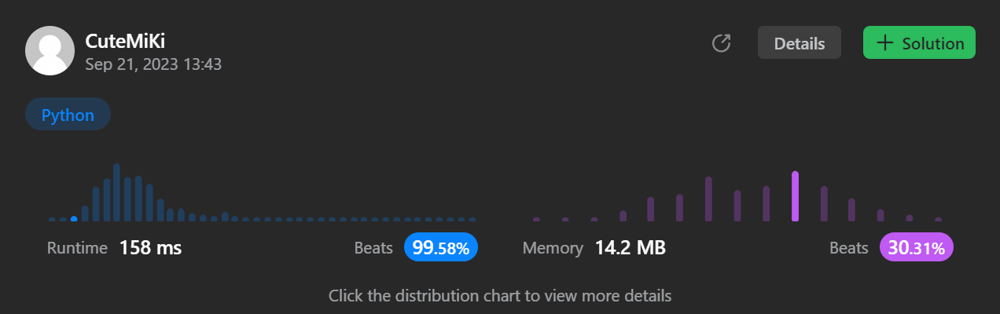

# 547. Number of Provinces
### Tag: [Medium](https://github.com/TheOnlyMiki/LeetCode-For-Fun/tree/main#medium-level), [Depth-First Search](https://github.com/TheOnlyMiki/LeetCode-For-Fun/tree/main#depth-first-search), [Breadth-First Search](https://github.com/TheOnlyMiki/LeetCode-For-Fun/tree/main#breadth-first-search), [Union Find](https://github.com/TheOnlyMiki/LeetCode-For-Fun/tree/main#union-find), [Graph](https://github.com/TheOnlyMiki/LeetCode-For-Fun/tree/main#graph)
---
<div class="px-5 pt-4"><div class="flex"></div><div class="xFUwe" data-track-load="description_content"><p>There are <code>n</code> cities. Some of them are connected, while some are not. If city <code>a</code> is connected directly with city <code>b</code>, and city <code>b</code> is connected directly with city <code>c</code>, then city <code>a</code> is connected indirectly with city <code>c</code>.</p>

<p>A <strong>province</strong> is a group of directly or indirectly connected cities and no other cities outside of the group.</p>

<p>You are given an <code>n x n</code> matrix <code>isConnected</code> where <code>isConnected[i][j] = 1</code> if the <code>i<sup>th</sup></code> city and the <code>j<sup>th</sup></code> city are directly connected, and <code>isConnected[i][j] = 0</code> otherwise.</p>

<p>Return <em>the total number of <strong>provinces</strong></em>.</p>

<p>&nbsp;</p>
<p><strong class="example">Example 1:</strong></p>

<pre><strong>Input:</strong> isConnected = [[1,1,0],[1,1,0],[0,0,1]]
<strong>Output:</strong> 2
</pre>

<p><strong class="example">Example 2:</strong></p>

<pre><strong>Input:</strong> isConnected = [[1,0,0],[0,1,0],[0,0,1]]
<strong>Output:</strong> 3
</pre>

<p>&nbsp;</p>
<p><strong>Constraints:</strong></p>

<ul>
	<li><code>1 &lt;= n &lt;= 200</code></li>
	<li><code>n == isConnected.length</code></li>
	<li><code>n == isConnected[i].length</code></li>
	<li><code>isConnected[i][j]</code> is <code>1</code> or <code>0</code>.</li>
	<li><code>isConnected[i][i] == 1</code></li>
	<li><code>isConnected[i][j] == isConnected[j][i]</code></li>
</ul>
</div></div>

---


### Solution

```python
class Solution(object):
    def findCircleNum(self, isConnected):
        """
        :type isConnected: List[List[int]]
        :rtype: int
        """
        n = range(len(isConnected))
        record = {i:{i} for i in n}

        for citys in isConnected:
            temp = set()
            for i in n:
                if citys[i] == 1:
                    temp |= record[i]
            for i in temp:
                record[i] = temp
        
        count = 0
        for i in n:
            if i in record:
                count += 1
                for city in record.pop(i):
                    record.pop(city, None)

        return count
```
