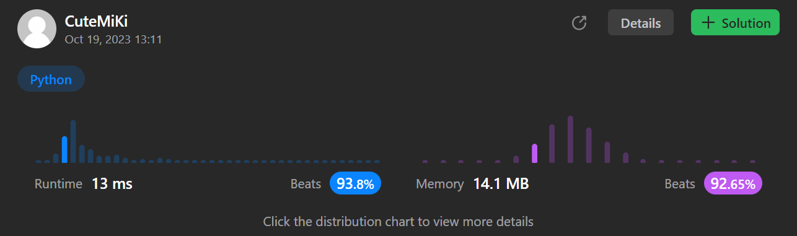

# 557. Reverse Words in a String III
### Tag: [Easy](https://github.com/TheOnlyMiki/LeetCode-For-Fun/tree/main#easy-level), [Two Pointers](https://github.com/TheOnlyMiki/LeetCode-For-Fun/tree/main#two-pointers), [String](https://github.com/TheOnlyMiki/LeetCode-For-Fun/tree/main#string)
---
<div class="px-5 pt-4"><div class="flex"></div><div class="xFUwe" data-track-load="description_content"><p>Given a string <code>s</code>, reverse the order of characters in each word within a sentence while still preserving whitespace and initial word order.</p>

<p>&nbsp;</p>
<p><strong class="example">Example 1:</strong></p>
<pre><strong>Input:</strong> s = "Let's take LeetCode contest"
<strong>Output:</strong> "s'teL ekat edoCteeL tsetnoc"
</pre><p><strong class="example">Example 2:</strong></p>
<pre><strong>Input:</strong> s = "God Ding"
<strong>Output:</strong> "doG gniD"
</pre>
<p>&nbsp;</p>
<p><strong>Constraints:</strong></p>

<ul>
	<li><code>1 &lt;= s.length &lt;= 5 * 10<sup>4</sup></code></li>
	<li><code>s</code> contains printable <strong>ASCII</strong> characters.</li>
	<li><code>s</code> does not contain any leading or trailing spaces.</li>
	<li>There is <strong>at least one</strong> word in <code>s</code>.</li>
	<li>All the words in <code>s</code> are separated by a single space.</li>
</ul>
</div></div>

---


### Solution

```python
class Solution(object):
    def reverseWords(self, s):
        """
        :type s: str
        :rtype: str
        """
        return ' '.join(s[::-1].split()[::-1])
        #return ' '.join(word[::-1] for word in s.split())
```
