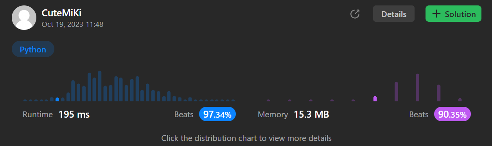

# 561. Array Partition
### Tag: [Easy](https://github.com/TheOnlyMiki/LeetCode-For-Fun/tree/main#easy-level), [Array](https://github.com/TheOnlyMiki/LeetCode-For-Fun/tree/main#array), [Greedy](https://github.com/TheOnlyMiki/LeetCode-For-Fun/tree/main#greedy), [Sorting](https://github.com/TheOnlyMiki/LeetCode-For-Fun/tree/main#sorting)
---
<div class="px-5 pt-4"><div class="flex"></div><div class="xFUwe" data-track-load="description_content"><p>Given an integer array <code>nums</code> of <code>2n</code> integers, group these integers into <code>n</code> pairs <code>(a<sub>1</sub>, b<sub>1</sub>), (a<sub>2</sub>, b<sub>2</sub>), ..., (a<sub>n</sub>, b<sub>n</sub>)</code> such that the sum of <code>min(a<sub>i</sub>, b<sub>i</sub>)</code> for all <code>i</code> is <strong>maximized</strong>. Return<em> the maximized sum</em>.</p>

<p>&nbsp;</p>
<p><strong class="example">Example 1:</strong></p>

<pre><strong>Input:</strong> nums = [1,4,3,2]
<strong>Output:</strong> 4
<strong>Explanation:</strong> All possible pairings (ignoring the ordering of elements) are:
1. (1, 4), (2, 3) -&gt; min(1, 4) + min(2, 3) = 1 + 2 = 3
2. (1, 3), (2, 4) -&gt; min(1, 3) + min(2, 4) = 1 + 2 = 3
3. (1, 2), (3, 4) -&gt; min(1, 2) + min(3, 4) = 1 + 3 = 4
So the maximum possible sum is 4.</pre>

<p><strong class="example">Example 2:</strong></p>

<pre><strong>Input:</strong> nums = [6,2,6,5,1,2]
<strong>Output:</strong> 9
<strong>Explanation:</strong> The optimal pairing is (2, 1), (2, 5), (6, 6). min(2, 1) + min(2, 5) + min(6, 6) = 1 + 2 + 6 = 9.
</pre>

<p>&nbsp;</p>
<p><strong>Constraints:</strong></p>

<ul>
	<li><code>1 &lt;= n &lt;= 10<sup>4</sup></code></li>
	<li><code>nums.length == 2 * n</code></li>
	<li><code>-10<sup>4</sup> &lt;= nums[i] &lt;= 10<sup>4</sup></code></li>
</ul>
</div></div>

---


### Solution

```python
class Solution(object):
    def arrayPairSum(self, nums):
        """
        :type nums: List[int]
        :rtype: int
        """
        output = 0
        for num in sorted(nums)[::2]:
            output += num
        return output
```
