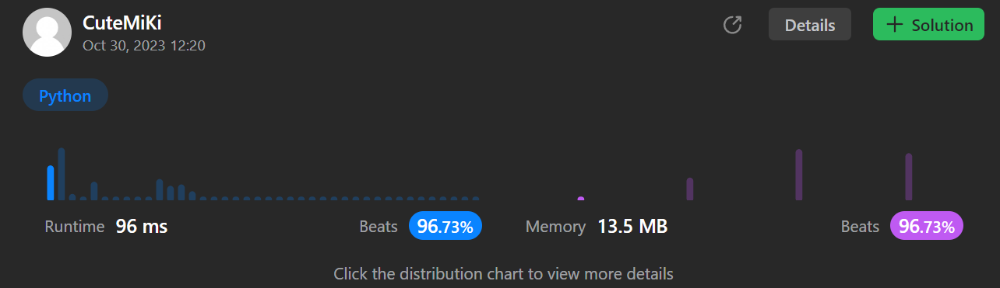

# 599. Minimum Index Sum of Two Lists
### Tag: [Easy](https://github.com/TheOnlyMiki/LeetCode-For-Fun/tree/main#easy-level), [Array](https://github.com/TheOnlyMiki/LeetCode-For-Fun/tree/main#array), [Hash Table](https://github.com/TheOnlyMiki/LeetCode-For-Fun/tree/main#hash-table), [String](https://github.com/TheOnlyMiki/LeetCode-For-Fun/tree/main#string)
---
<div class="px-5 pt-4"><div class="flex"></div><div class="xFUwe" data-track-load="description_content"><p>Given two arrays of strings <code>list1</code> and <code>list2</code>, find the <strong>common strings with the least index sum</strong>.</p>

<p>A <strong>common string</strong> is a string that appeared in both <code>list1</code> and <code>list2</code>.</p>

<p>A <strong>common string with the least index sum</strong> is a common string such that if it appeared at <code>list1[i]</code> and <code>list2[j]</code> then <code>i + j</code> should be the minimum value among all the other <strong>common strings</strong>.</p>

<p>Return <em>all the <strong>common strings with the least index sum</strong></em>. Return the answer in <strong>any order</strong>.</p>

<p>&nbsp;</p>
<p><strong class="example">Example 1:</strong></p>

<pre><strong>Input:</strong> list1 = ["Shogun","Tapioca Express","Burger King","KFC"], list2 = ["Piatti","The Grill at Torrey Pines","Hungry Hunter Steakhouse","Shogun"]
<strong>Output:</strong> ["Shogun"]
<strong>Explanation:</strong> The only common string is "Shogun".
</pre>

<p><strong class="example">Example 2:</strong></p>

<pre><strong>Input:</strong> list1 = ["Shogun","Tapioca Express","Burger King","KFC"], list2 = ["KFC","Shogun","Burger King"]
<strong>Output:</strong> ["Shogun"]
<strong>Explanation:</strong> The common string with the least index sum is "Shogun" with index sum = (0 + 1) = 1.
</pre>

<p><strong class="example">Example 3:</strong></p>

<pre><strong>Input:</strong> list1 = ["happy","sad","good"], list2 = ["sad","happy","good"]
<strong>Output:</strong> ["sad","happy"]
<strong>Explanation:</strong> There are three common strings:
"happy" with index sum = (0 + 1) = 1.
"sad" with index sum = (1 + 0) = 1.
"good" with index sum = (2 + 2) = 4.
The strings with the least index sum are "sad" and "happy".
</pre>

<p>&nbsp;</p>
<p><strong>Constraints:</strong></p>

<ul>
	<li><code>1 &lt;= list1.length, list2.length &lt;= 1000</code></li>
	<li><code>1 &lt;= list1[i].length, list2[i].length &lt;= 30</code></li>
	<li><code>list1[i]</code> and <code>list2[i]</code> consist of spaces <code>' '</code> and English letters.</li>
	<li>All the strings of <code>list1</code> are <strong>unique</strong>.</li>
	<li>All the strings of <code>list2</code> are <strong>unique</strong>.</li>
	<li>There is at least a common string between <code>list1</code> and <code>list2</code>.</li>
</ul>
</div></div>

---


### Solution

```python
class Solution(object):
    def findRestaurant(self, list1, list2):
        """
        :type list1: List[str]
        :type list2: List[str]
        :rtype: List[str]
        """
        indexs = { word:i for i, word in enumerate(list1) }
        minimum, output = len(list1)+len(list2), []
        for i, word in enumerate(list2):
            if word in indexs:
                if minimum == indexs[word] + i:
                    output.append(word)
                elif minimum > indexs[word] + i:
                    minimum, output = indexs[word] + i, [word]

        return output
```
