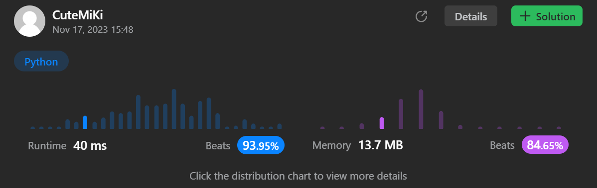

# 622. Design Circular Queue
### Tag: [Medium](https://github.com/TheOnlyMiki/LeetCode-For-Fun/tree/main#medium-level), [Array](https://github.com/TheOnlyMiki/LeetCode-For-Fun/tree/main#array), [Linked List](https://github.com/TheOnlyMiki/LeetCode-For-Fun/tree/main#linked-list), [Design](https://github.com/TheOnlyMiki/LeetCode-For-Fun/tree/main#design), [Queue](https://github.com/TheOnlyMiki/LeetCode-For-Fun/tree/main#queue)
---
<div class="px-5 pt-4"><div class="flex"></div><div class="xFUwe" data-track-load="description_content"><p>Design your implementation of the circular queue. The circular queue is a linear data structure in which the operations are performed based on FIFO (First In First Out) principle, and the last position is connected back to the first position to make a circle. It is also called "Ring Buffer".</p>

<p>One of the benefits of the circular queue is that we can make use of the spaces in front of the queue. In a normal queue, once the queue becomes full, we cannot insert the next element even if there is a space in front of the queue. But using the circular queue, we can use the space to store new values.</p>

<p>Implement the <code>MyCircularQueue</code> class:</p>

<ul>
	<li><code>MyCircularQueue(k)</code> Initializes the object with the size of the queue to be <code>k</code>.</li>
	<li><code>int Front()</code> Gets the front item from the queue. If the queue is empty, return <code>-1</code>.</li>
	<li><code>int Rear()</code> Gets the last item from the queue. If the queue is empty, return <code>-1</code>.</li>
	<li><code>boolean enQueue(int value)</code> Inserts an element into the circular queue. Return <code>true</code> if the operation is successful.</li>
	<li><code>boolean deQueue()</code> Deletes an element from the circular queue. Return <code>true</code> if the operation is successful.</li>
	<li><code>boolean isEmpty()</code> Checks whether the circular queue is empty or not.</li>
	<li><code>boolean isFull()</code> Checks whether the circular queue is full or not.</li>
</ul>

<p>You must solve the problem without using the built-in queue data structure in your programming language.&nbsp;</p>

<p>&nbsp;</p>
<p><strong class="example">Example 1:</strong></p>

<pre><strong>Input</strong>
["MyCircularQueue", "enQueue", "enQueue", "enQueue", "enQueue", "Rear", "isFull", "deQueue", "enQueue", "Rear"]
[[3], [1], [2], [3], [4], [], [], [], [4], []]
<strong>Output</strong>
[null, true, true, true, false, 3, true, true, true, 4]

<strong>Explanation</strong>
MyCircularQueue myCircularQueue = new MyCircularQueue(3);
myCircularQueue.enQueue(1); // return True
myCircularQueue.enQueue(2); // return True
myCircularQueue.enQueue(3); // return True
myCircularQueue.enQueue(4); // return False
myCircularQueue.Rear();     // return 3
myCircularQueue.isFull();   // return True
myCircularQueue.deQueue();  // return True
myCircularQueue.enQueue(4); // return True
myCircularQueue.Rear();     // return 4
</pre>

<p>&nbsp;</p>
<p><strong>Constraints:</strong></p>

<ul>
	<li><code>1 &lt;= k &lt;= 1000</code></li>
	<li><code>0 &lt;= value &lt;= 1000</code></li>
	<li>At most <code>3000</code> calls will be made to&nbsp;<code>enQueue</code>, <code>deQueue</code>,&nbsp;<code>Front</code>,&nbsp;<code>Rear</code>,&nbsp;<code>isEmpty</code>, and&nbsp;<code>isFull</code>.</li>
</ul>
</div></div>

---


### Solution

```python
# Option 2 - Array Method
class MyCircularQueue(object):

    def __init__(self, k):
        '''
        :type k: int
        '''
        self.head = self.index = 0
        self.length = k
        self.store = [-1]*k

    def enQueue(self, value):
        '''
        :type value: int
        :rtype: bool
        '''
        if self.isFull():
            return False

        self.store[ (self.head + self.index) % self.length ] = value
        self.index += 1
        return True

    def deQueue(self):
        '''
        :rtype: bool
        '''
        if self.isEmpty():
            return False

        self.store[self.head] = -1
        self.head, self.index = (self.head+1)%self.length, self.index-1
        return True

    def Front(self):
        '''
        :rtype: int
        '''
        return self.store[self.head]

    def Rear(self):
        '''
        :rtype: int
        '''
        return self.store[ (self.head + self.index - 1) % self.length ]

    def isEmpty(self):
        '''
        :rtype: bool
        '''
        return self.index == 0

    def isFull(self):
        '''
        :rtype: bool
        '''
        return self.index == self.length


# Option 1 - Linked List Method
"""
class Node(object):
    def __init__(self, val=None, next=None):
        self.val = val
        self.next = next

class MyCircularQueue(object):

    def __init__(self, k):
        '''
        :type k: int
        '''
        self.head = self.last = current = Node(val=-1)
        while k != 1:
            current.next = Node(val=-1)
            k, current = k-1, current.next

        current.next = self.head

    def enQueue(self, value):
        '''
        :type value: int
        :rtype: bool
        '''
        if self.isFull():
            return False

        if self.last.val != -1:
            self.last = self.last.next

        self.last.val = value

        return True

    def deQueue(self):
        '''
        :rtype: bool
        '''
        if self.isEmpty():
            return False

        self.head.val = -1

        if self.head.next.val != -1:
            self.head = self.head.next
            
        return True

    def Front(self):
        '''
        :rtype: int
        '''
        return self.head.val

    def Rear(self):
        '''
        :rtype: int
        '''
        return self.last.val

    def isEmpty(self):
        '''
        :rtype: bool
        '''
        return True if self.head.val == -1 else False

    def isFull(self):
        '''
        :rtype: bool
        '''
        return False if self.last.next.val == -1 else True
"""

# Your MyCircularQueue object will be instantiated and called as such:
# obj = MyCircularQueue(k)
# param_1 = obj.enQueue(value)
# param_2 = obj.deQueue()
# param_3 = obj.Front()
# param_4 = obj.Rear()
# param_5 = obj.isEmpty()
# param_6 = obj.isFull()
```
