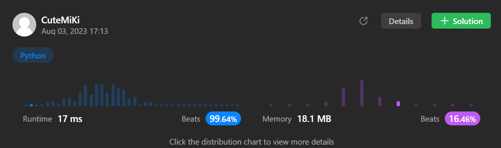

# 637. Average of Levels in Binary Tree
### Tag: [Easy](https://github.com/TheOnlyMiki/LeetCode-For-Fun/tree/main#easy-level), [Depth-First Search](https://github.com/TheOnlyMiki/LeetCode-For-Fun/tree/main#depth-first-search), [Breadth-First Search](https://github.com/TheOnlyMiki/LeetCode-For-Fun/tree/main#breadth-first-search), [Binary Tree](https://github.com/TheOnlyMiki/LeetCode-For-Fun/tree/main#binary-tree)
---
<div class="px-5 pt-4"><div class="flex"></div><div class="_1l1MA" data-track-load="description_content">Given the <code>root</code> of a binary tree, return <em>the average value of the nodes on each level in the form of an array</em>. Answers within <code>10<sup>-5</sup></code> of the actual answer will be accepted.
<p>&nbsp;</p>
<p><strong class="example">Example 1:</strong></p>

<pre><strong>Input:</strong> root = [3,9,20,null,null,15,7]
<strong>Output:</strong> [3.00000,14.50000,11.00000]
Explanation: The average value of nodes on level 0 is 3, on level 1 is 14.5, and on level 2 is 11.
Hence return [3, 14.5, 11].
</pre>

<p><strong class="example">Example 2:</strong></p>

<pre><strong>Input:</strong> root = [3,9,20,15,7]
<strong>Output:</strong> [3.00000,14.50000,11.00000]
</pre>

<p>&nbsp;</p>
<p><strong>Constraints:</strong></p>

<ul>
	<li>The number of nodes in the tree is in the range <code>[1, 10<sup>4</sup>]</code>.</li>
	<li><code>-2<sup>31</sup> &lt;= Node.val &lt;= 2<sup>31</sup> - 1</code></li>
</ul>
</div></div>

---


### Solution

```python
# Definition for a binary tree node.
# class TreeNode(object):
#     def __init__(self, val=0, left=None, right=None):
#         self.val = val
#         self.left = left
#         self.right = right
class Solution(object):
    def averageOfLevels(self, root):
        """
        :type root: TreeNode
        :rtype: List[float]
        """
        if not root:
            return []

        output = [float(root.val)]
        nodes = [root]
        next_level = store = None

        while nodes:
            next_level = []
            store = []
            for node in nodes:
                if node.left:
                    next_level.append(node.left)
                    store.append(node.left.val)
                if node.right:
                    next_level.append(node.right)
                    store.append(node.right.val)
            nodes = next_level
            if store:
                output.append(float(sum(store)) / len(store))

        return output
```
