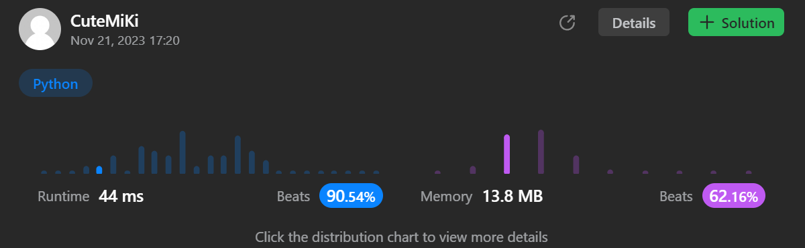

# 641. Design Circular Deque
### Tag: [Medium](https://github.com/TheOnlyMiki/LeetCode-For-Fun/tree/main#medium-level), [Array](https://github.com/TheOnlyMiki/LeetCode-For-Fun/tree/main#array), [Linked List](https://github.com/TheOnlyMiki/LeetCode-For-Fun/tree/main#linked-list), [Design](https://github.com/TheOnlyMiki/LeetCode-For-Fun/tree/main#design), [Queue](https://github.com/TheOnlyMiki/LeetCode-For-Fun/tree/main#queue)
---
<div class="px-5 pt-4"><div class="flex"></div><div class="xFUwe" data-track-load="description_content"><p>Design your implementation of the circular double-ended queue (deque).</p>

<p>Implement the <code>MyCircularDeque</code> class:</p>

<ul>
	<li><code>MyCircularDeque(int k)</code> Initializes the deque with a maximum size of <code>k</code>.</li>
	<li><code>boolean insertFront()</code> Adds an item at the front of Deque. Returns <code>true</code> if the operation is successful, or <code>false</code> otherwise.</li>
	<li><code>boolean insertLast()</code> Adds an item at the rear of Deque. Returns <code>true</code> if the operation is successful, or <code>false</code> otherwise.</li>
	<li><code>boolean deleteFront()</code> Deletes an item from the front of Deque. Returns <code>true</code> if the operation is successful, or <code>false</code> otherwise.</li>
	<li><code>boolean deleteLast()</code> Deletes an item from the rear of Deque. Returns <code>true</code> if the operation is successful, or <code>false</code> otherwise.</li>
	<li><code>int getFront()</code> Returns the front item from the Deque. Returns <code>-1</code> if the deque is empty.</li>
	<li><code>int getRear()</code> Returns the last item from Deque. Returns <code>-1</code> if the deque is empty.</li>
	<li><code>boolean isEmpty()</code> Returns <code>true</code> if the deque is empty, or <code>false</code> otherwise.</li>
	<li><code>boolean isFull()</code> Returns <code>true</code> if the deque is full, or <code>false</code> otherwise.</li>
</ul>

<p>&nbsp;</p>
<p><strong class="example">Example 1:</strong></p>

<pre><strong>Input</strong>
["MyCircularDeque", "insertLast", "insertLast", "insertFront", "insertFront", "getRear", "isFull", "deleteLast", "insertFront", "getFront"]
[[3], [1], [2], [3], [4], [], [], [], [4], []]
<strong>Output</strong>
[null, true, true, true, false, 2, true, true, true, 4]

<strong>Explanation</strong>
MyCircularDeque myCircularDeque = new MyCircularDeque(3);
myCircularDeque.insertLast(1);  // return True
myCircularDeque.insertLast(2);  // return True
myCircularDeque.insertFront(3); // return True
myCircularDeque.insertFront(4); // return False, the queue is full.
myCircularDeque.getRear();      // return 2
myCircularDeque.isFull();       // return True
myCircularDeque.deleteLast();   // return True
myCircularDeque.insertFront(4); // return True
myCircularDeque.getFront();     // return 4
</pre>

<p>&nbsp;</p>
<p><strong>Constraints:</strong></p>

<ul>
	<li><code>1 &lt;= k &lt;= 1000</code></li>
	<li><code>0 &lt;= value &lt;= 1000</code></li>
	<li>At most <code>2000</code> calls will be made to <code>insertFront</code>, <code>insertLast</code>, <code>deleteFront</code>, <code>deleteLast</code>, <code>getFront</code>, <code>getRear</code>, <code>isEmpty</code>, <code>isFull</code>.</li>
</ul>
</div></div>

---


### Solution

```python
# Option 2 - Array Method
class MyCircularDeque(object):

    def __init__(self, k):
        '''
        :type k: int
        '''
        self.head = self.index = 0
        self.length = k
        self.store = [-1]*k

    def insertFront(self, value):
        '''
        :type value: int
        :rtype: bool
        '''
        if self.isFull():
            return False

        self.head = (self.head-1) % self.length
        self.store[ self.head ] = value
        self.index += 1
        return True

    def insertLast(self, value):
        '''
        :type value: int
        :rtype: bool
        '''
        if self.isFull():
            return False

        self.store[ (self.head + self.index) % self.length ] = value
        self.index += 1
        return True

    def deleteFront(self):
        '''
        :rtype: bool
        '''
        if self.isEmpty():
            return False

        self.store[self.head] = -1
        self.head = (self.head+1) % self.length
        self.index -= 1
        return True

    def deleteLast(self):
        '''
        :rtype: bool
        '''
        if self.isEmpty():
            return False

        self.store[ (self.head + self.index - 1) % self.length ] = -1
        self.index -= 1
        return True

    def getFront(self):
        '''
        :rtype: int
        '''
        return self.store[self.head]

    def getRear(self):
        '''
        :rtype: int
        '''
        return self.store[ (self.head + self.index - 1) % self.length ]

    def isEmpty(self):
        '''
        :rtype: bool
        '''
        return self.index == 0

    def isFull(self):
        '''
        :rtype: bool
        '''
        return self.index == self.length


# Option 1 - Linked List Method
"""
class Node(object):
    def __init__(self, val=None, next=None, prev=None):
        self.val = val
        self.next = next
        self.prev = prev

class MyCircularDeque(object):

    def __init__(self, k):
        '''
        :type k: int
        '''
        self.head = self.last = current = Node(val=-1)
        while k != 1:
            current.next = Node(val=-1,prev=current)
            k, current = k-1, current.next

        current.next, self.head.prev = self.head, current

    def insertFront(self, value):
        '''
        :type value: int
        :rtype: bool
        '''
        if self.isFull():
            return False

        if self.head.val != -1:
            self.head = self.head.prev

        self.head.val = value

        return True

    def insertLast(self, value):
        '''
        :type value: int
        :rtype: bool
        '''
        if self.isFull():
            return False

        if self.last.val != -1:
            self.last = self.last.next

        self.last.val = value

        return True

    def deleteFront(self):
        '''
        :rtype: bool
        '''
        if self.isEmpty():
            return False

        self.head.val = -1

        if self.head.next.val != -1:
            self.head = self.head.next

        return True

    def deleteLast(self):
        '''
        :rtype: bool
        '''
        if self.isEmpty():
            return False

        self.last.val = -1

        if self.last.prev.val != -1:
            self.last = self.last.prev

        return True

    def getFront(self):
        '''
        :rtype: int
        '''
        return self.head.val

    def getRear(self):
        '''
        :rtype: int
        '''
        return self.last.val

    def isEmpty(self):
        '''
        :rtype: bool
        '''
        return True if self.head.val == -1 else False

    def isFull(self):
        '''
        :rtype: bool
        '''
        return False if self.last.next.val == -1 else True
"""

# Your MyCircularDeque object will be instantiated and called as such:
# obj = MyCircularDeque(k)
# param_1 = obj.insertFront(value)
# param_2 = obj.insertLast(value)
# param_3 = obj.deleteFront()
# param_4 = obj.deleteLast()
# param_5 = obj.getFront()
# param_6 = obj.getRear()
# param_7 = obj.isEmpty()
# param_8 = obj.isFull()
```
