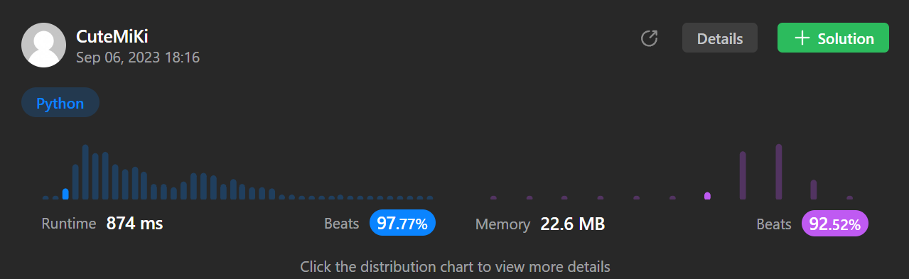

# 643. Maximum Average Subarray I
### Tag: [Easy](https://github.com/TheOnlyMiki/LeetCode-For-Fun/tree/main#easy-level), [Array](https://github.com/TheOnlyMiki/LeetCode-For-Fun/tree/main#array), [Sliding Window](https://github.com/TheOnlyMiki/LeetCode-For-Fun/tree/main#sliding-window)
---
<div class="px-5 pt-4"><div class="flex"></div><div class="xFUwe" data-track-load="description_content"><p>You are given an integer array <code>nums</code> consisting of <code>n</code> elements, and an integer <code>k</code>.</p>

<p>Find a contiguous subarray whose <strong>length is equal to</strong> <code>k</code> that has the maximum average value and return <em>this value</em>. Any answer with a calculation error less than <code>10<sup>-5</sup></code> will be accepted.</p>

<p>&nbsp;</p>
<p><strong class="example">Example 1:</strong></p>

<pre><strong>Input:</strong> nums = [1,12,-5,-6,50,3], k = 4
<strong>Output:</strong> 12.75000
<strong>Explanation:</strong> Maximum average is (12 - 5 - 6 + 50) / 4 = 51 / 4 = 12.75
</pre>

<p><strong class="example">Example 2:</strong></p>

<pre><strong>Input:</strong> nums = [5], k = 1
<strong>Output:</strong> 5.00000
</pre>

<p>&nbsp;</p>
<p><strong>Constraints:</strong></p>

<ul>
	<li><code>n == nums.length</code></li>
	<li><code>1 &lt;= k &lt;= n &lt;= 10<sup>5</sup></code></li>
	<li><code>-10<sup>4</sup> &lt;= nums[i] &lt;= 10<sup>4</sup></code></li>
</ul>
</div></div>

---


### Solution

```python
class Solution(object):
    def findMaxAverage(self, nums, k):
        """
        :type nums: List[int]
        :type k: int
        :rtype: float
        """
        output = consum = sum(nums[i] for i in range(k))

        for i in range(len(nums)-k):
            consum += nums[i+k] - nums[i]

            if consum > output:
                output = consum
        
        return output / float(k)
```
