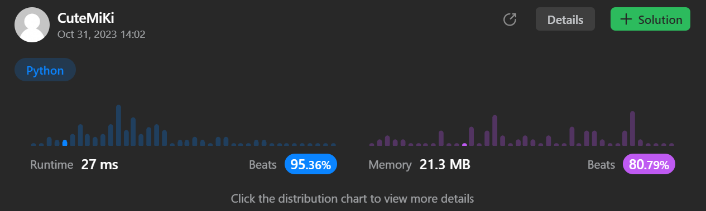

# 652. Find Duplicate Subtrees
### Tag: [Medium](https://github.com/TheOnlyMiki/LeetCode-For-Fun/tree/main#medium-level), [Hash Table](https://github.com/TheOnlyMiki/LeetCode-For-Fun/tree/main#hash-table), [Depth-First Search](https://github.com/TheOnlyMiki/LeetCode-For-Fun/tree/main#depth-first-search), [Binary Tree](https://github.com/TheOnlyMiki/LeetCode-For-Fun/tree/main#binary-tree)
---
<div class="px-5 pt-4"><div class="flex"></div><div class="xFUwe" data-track-load="description_content"><p>Given the <code>root</code>&nbsp;of a binary tree, return all <strong>duplicate subtrees</strong>.</p>

<p>For each kind of duplicate subtrees, you only need to return the root node of any <b>one</b> of them.</p>

<p>Two trees are <strong>duplicate</strong> if they have the <strong>same structure</strong> with the <strong>same node values</strong>.</p>

<p>&nbsp;</p>
<p><strong class="example">Example 1:</strong></p>

<pre><strong>Input:</strong> root = [1,2,3,4,null,2,4,null,null,4]
<strong>Output:</strong> [[2,4],[4]]
</pre>

<p><strong class="example">Example 2:</strong></p>

<pre><strong>Input:</strong> root = [2,1,1]
<strong>Output:</strong> [[1]]
</pre>

<p><strong class="example">Example 3:</strong></p>

<pre><strong>Input:</strong> root = [2,2,2,3,null,3,null]
<strong>Output:</strong> [[2,3],[3]]
</pre>

<p>&nbsp;</p>
<p><strong>Constraints:</strong></p>

<ul>
	<li>The number of the nodes in the tree will be in the range <code>[1, 5000]</code></li>
	<li><code>-200 &lt;= Node.val &lt;= 200</code></li>
</ul>
</div></div>

---


### Solution

```python
# Definition for a binary tree node.
# class TreeNode(object):
#     def __init__(self, val=0, left=None, right=None):
#         self.val = val
#         self.left = left
#         self.right = right
class Solution(object):
    def findDuplicateSubtrees(self, root):
        """
        :type root: TreeNode
        :rtype: List[TreeNode]
        """
        visit = set()
        record = {}

        def dfs(node):
            if node:
                nodename = str(node.val) + ',' + dfs(node.left) + ',' + dfs(node.right)
                if nodename in visit:
                    record[nodename] = node

                visit.add(nodename)
                return nodename

            return 'n'

        dfs(root.left)
        dfs(root.right)
        
        return [ node for node in record.values() ]
```
