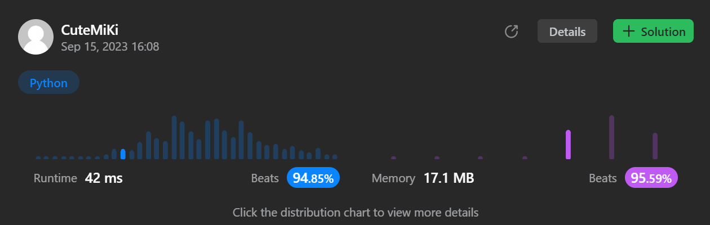

# 700. Search in a Binary Search Tree
### Tag: [Easy](https://github.com/TheOnlyMiki/LeetCode-For-Fun/tree/main#easy-level), [Binary Search](https://github.com/TheOnlyMiki/LeetCode-For-Fun/tree/main#binary-search), [Binary Tree](https://github.com/TheOnlyMiki/LeetCode-For-Fun/tree/main#binary-tree)
---
<div class="px-5 pt-4"><div class="flex"></div><div class="xFUwe" data-track-load="description_content"><p>You are given the <code>root</code> of a binary search tree (BST) and an integer <code>val</code>.</p>

<p>Find the node in the BST that the node's value equals <code>val</code> and return the subtree rooted with that node. If such a node does not exist, return <code>null</code>.</p>

<p>&nbsp;</p>
<p><strong class="example">Example 1:</strong></p>

<pre><strong>Input:</strong> root = [4,2,7,1,3], val = 2
<strong>Output:</strong> [2,1,3]
</pre>

<p><strong class="example">Example 2:</strong></p>

<pre><strong>Input:</strong> root = [4,2,7,1,3], val = 5
<strong>Output:</strong> []
</pre>

<p>&nbsp;</p>
<p><strong>Constraints:</strong></p>

<ul>
	<li>The number of nodes in the tree is in the range <code>[1, 5000]</code>.</li>
	<li><code>1 &lt;= Node.val &lt;= 10<sup>7</sup></code></li>
	<li><code>root</code> is a binary search tree.</li>
	<li><code>1 &lt;= val &lt;= 10<sup>7</sup></code></li>
</ul>
</div></div>

---


### Solution

```python
# Definition for a binary tree node.
# class TreeNode(object):
#     def __init__(self, val=0, left=None, right=None):
#         self.val = val
#         self.left = left
#         self.right = right
class Solution(object):
    def searchBST(self, root, val):
        """
        :type root: TreeNode
        :type val: int
        :rtype: TreeNode
        """
        # Option 2
        while root:
            if root.val == val:
                return root
            
            root = root.left if root.val > val else root.right

        return None

        # Option 1
        """
        def dfs(node):
            if node:
                if node.val > val:
                    return dfs(node.left)
                elif node.val < val:
                    return dfs(node.right)
                else:
                    return node

            return None

        return dfs(root)
        """
```
